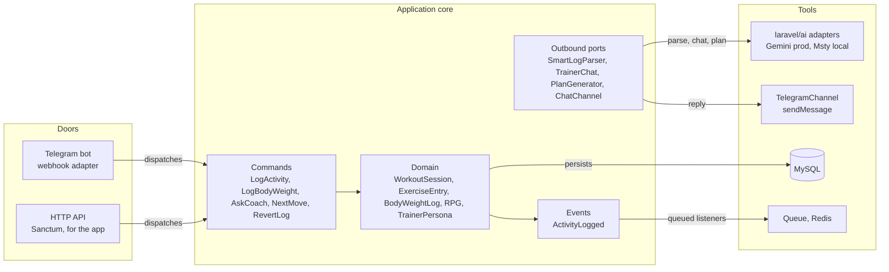
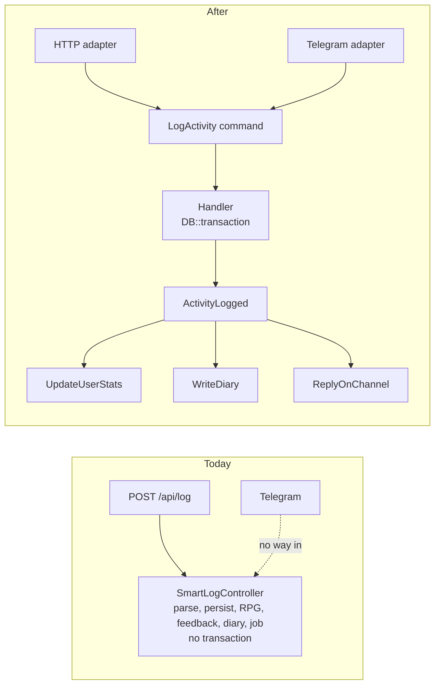

# Feetness plan

One file: where we are, what we have, what we plan, how it works, how it is tested, and what it looks like for the person using it. Written 2026-09-27 after a planning sprint (no code written). Companion: `PROJECT.md` is the short cockpit; this is the plan.

---

## 1. Where we are

**What exists today** (repo `work-it-out`, Laravel 13, API only, never run in this checkout):

| Area | State |
|---|---|
| Auth | Sanctum bearer tokens, register and login work, per-user data scoping is solid |
| Logging | `POST /api/log` takes free text, one AI call parses it and returns three coach reactions, RPG deltas, a diary line. Persists workout, feedback, diary |
| Structured workouts, body weight | CRUD works, transactional, tested |
| Coaches | Lt. Surge, Shen, Latika as an enum, each owning its prompt. Chat with memory via the AI SDK |
| Plans | Weekly workout plan (and a meal plan) as markdown |
| Stats | Personal records computed from logged data, RPG core stats, custom stats, dashboard |
| AI layer | Behind ports with adapters and test fakes. Free local model in dev (Msty), gemini-2.5-flash planned for prod, 20 AI calls per user per hour |
| Tests | Pest, contract tests with fakes for every AI port. Dashboard, body weight, diary, profile update untested |
| Deploy | Dockerfile, compose, supervisord with queue workers. Nothing deployed |

**What is wrong today** (worst first):

1. Two probable fatals in the AI adapters: `SdkSmartLogParser.php:26` and `SdkPlanGenerator.php:33` call `->forUser()` on agents that are not conversational (the working form is in `NutritionParserService.php:28-36`). If confirmed, every AI log and plan call crashes. Cannot verify until `vendor/` is installed.
2. AI-logged workouts are saved with `completed_planned = false` (`SmartLogController.php:140`); adherence only counts `true`, so it reads 0% forever.
3. The smart-log write is not in a transaction and the diary content can be null (`SmartLogController.php:62-110`, `:105`).
4. App timezone is UTC for a user in Amsterdam: a 00:30 log lands on yesterday, a Monday 00:30 log in last week.
5. Free text fragments: two messages from one gym visit become two sessions; "bench", "Bench Press", "benchpress" become three PRs.
6. No tests for dashboard, nutrition, body weight, diary, profile update. Seeder has one user and leaves RPG, feedback and diary tables empty.
7. Nutrition is woven through the log schema, the trainer context, Latika's prompt, the dashboard and the seeder.

**What we plan:** make the backend correct and fully simulated, put Telegram on it as the first interface, deploy it for Hiren alone, then a documented API, then an app.

---

## 2. What it is for the person using it

Feetness is a training log with three coaches. You tell it what you did in plain words. It turns that into real data (sets, reps, weights, distance, time), keeps your personal records, and grows an RPG-style stat sheet: Strength, Stamina, Vitality. Three coaches react to every log and can be asked for advice:

- **Lt. Surge** pushes you and holds you to your goals. Strength.
- **Shen** is the "what do I do next" coach. He reads what you trained this week and suggests 3 or 4 options for today, with the actual lifts. Stamina.
- **Latika** covers stretching, mobility, sleep, recovery, longevity. Vitality.

No food or diet tracking. The app is called work-it-out; it tracks working out and body weight.

**Two ways in, one core:**

- **Telegram** (first). For the moments you are at the gym or just left it. You text what you did, you get the three coaches back. You can ask a coach a question or ask Shen what to train next. You log your weight. That is all Telegram does.
- **The app** (later, Flutter or Nuxt). For everything you look at: profile and goals, history, stats, records, the RPG sheet, weight chart, weekly plan, diary. One day the chat may also handle goals ("short term: bench 100, long term: 90 kg").

**A day, seen from the phone:**

```
You:    benched 3x8 at 80kg then incline dumbbell 3x10 at 30
Bot:    Logged: Bench Press 3x8 @80kg, Incline DB Press 3x10 @30kg
        Lt. Surge: 80 for 8 is your new baseline, Soldier. 82.5 next cycle.
        Shen: upper body's done for the week, legs haven't seen you.
        Latika: hips and shoulders will be tight tomorrow, ten minutes of stretching tonight.
        STR 12 (+2)  STA 10  VIT 10

You:    104.5kg
Bot:    Logged 104.5 kg (-0.5 since 20 Sep). Target 95.0.

You:    what next?
Bot:    Shen: push today, pull yesterday, so legs or core next. Pick one:
        1. Squat day (~50 min): Back squat, Leg press, Walking lunges
        2. Deadlift day (~45 min): Deadlift, Romanian deadlift, Hip thrust
        3. Abs (~25 min): Hanging leg raise, Plank, Cable crunch
        4. Cardio + mobility (~40 min): 30 min zone 2 bike, 10 min stretch
        Reply 1-4, or just tell me what you did after.

You:    /undo
Bot:    Removed: Bench Press 3x8 @80kg, Incline DB Press 3x10 @30kg. Stats restored.
```

---

## 3. How it works

### Two doors, one core

Telegram and the app are two driving adapters. Both build the same commands. The core never imports a request type or a Telegram array. Adding WhatsApp later is one more box on the left; adding the app is zero new boxes, it uses the HTTP door.



### The first refactor: the controller

Today everything after parsing lives inside `SmartLogController`. A Telegram handler cannot call an HTTP controller. Move it once into a command handler both doors reach; the controller becomes validation plus one dispatch.



### One Telegram message

Telegram retries an update until it gets a 200, so the webhook must answer fast and must recognise an update it already saw, or you log the same bench session twice.


### Patterns used (refactoring.guru names)

| Pattern | Where |
|---|---|
| Adapter | `Sdk*` classes wrap the AI SDK behind `app/Contracts/Ai/*` (in code). `TelegramChannel` behind a `ChatChannel` port with a `FakeChatChannel` in tests (to add) |
| Strategy | `TrainerPersona` enum owns each coach's prompt (in code) |
| Command | One class per user intent: `LogActivity`, `LogBodyWeight`, `AskCoach`, `NextMove`, `RevertLog` (to add) |
| Chain of Responsibility | Chat intent resolvers in a fixed order; Laravel middleware on the webhook (to add) |
| Observer | `ActivityLogged` event; stats, diary and reply are queued listeners (to add) |
| Null Object | `LogChannel` so `php artisan channel:simulate` runs the whole path with no Telegram (to add) |

### Shen's next move: PHP decides, the model talks

A PHP taxonomy classifies every exercise name into push, pull, squat, hinge, core, conditioning. A rollup says which are fresh (trained today or yesterday) and which are stale. Release 1 answers `/next` from rules only, zero AI, deterministic and unit-tested. After release the model phrases the same candidates in Shen's voice; the server validates the model's answer against the same taxonomy and falls back to the rules when the model is down.

### AI cost

Already flat by design: one structured call per log, zero-AI reads, local model in dev, gemini-2.5-flash in prod. The plan adds one budget shared by HTTP and chat (20 per user per hour, a global daily cap), an `ai_usage` ledger so cost is measured, and Shen's rules path so `/next` costs nothing.

---

## 4. Decisions (settled)

- Backend first. Telegram is the sole interface for release 1. App after the API contract is documented and stable.
- Telegram does: log activities in free text, log weight, ask a coach, ask Shen what next, undo. Telegram does not do: profile, goals, stats, history. Those are the app.
- No nutrition. Delete it from v1 (git keeps it): routes, controller, parser port and fake, meal plan, `MealType`, migration, factory, seeder rows, the meal fields in the log schema, `today_nutrition` in coach context, the dashboard macros. Latika keeps recovery, mobility, sleep, longevity.
- Client: Flutter (optimistic, learning goal) or Nuxt 4 (fallback for speed). Decide after M10. Backend stays client-agnostic.
- Timezone: Europe/Amsterdam app-wide.
- Identity on Telegram is the numeric user id, allowlisted to Hiren alone at first deploy. Link codes and multi-user come when a named second person wants in.
- Always design patterns, one UI library, atomic design.
- A sitting is one focused evening. No code without Hiren's green light; branch, merge to `master` when the milestone gate passes.

---

## 5. The plan

Every milestone ends in something Hiren can use and a gate of concrete checks. Every step has a test that runs with zero AI calls (the fakes in `tests/Fakes`) or an exact curl. Estimates are by step; add 30 percent before promising a date.

| Milestone | Sittings | You can then |
|---|---|---|
| M0 Sync, baseline, CI | 1.5 | Run the API locally, know which tests pass, CI on every branch |
| M1 AI adapters actually run | 2 | Curl a free-text log and get three coach reactions from the local model |
| M2 Bulletproof the write path | 4.5 | Log two messages from one visit and see one session, right adherence, full undo |
| M3 Remove nutrition | 1 | A fitness-only backend; Latika is a recovery coach |
| M4 Simulate from seed and fakes | 2.5 | `make fresh` gives two realistic users; `make test` replays a full week and proves the numbers |
| M5 Channel core, zero-AI commands, rules `/next`, shared budget | 4 | `php artisan channel:simulate "benched 100 3x5"` prints exactly the reply the phone will get |
| M6 Telegram, hardening, deploy. **Release 1** | 6.5 | Text the bot from the gym; nobody else can reach a model |
| M7 Coach chat and `/plan` over Telegram | 1.5 | Ask Surge how the week went, continue tomorrow |
| M8 Shen next-move with the model | 2.5 | `/next` in Shen's voice, same answer when the model is down |
| M9 Intake for the contract | 1 | A blank profile completes over the API in one request |
| M10 API contract. **Release 3** | 2.5 | Hand `openapi.yaml` plus fixtures to any client |
| M11 Voice notes | 1 | Talk a workout into Telegram |
| M12 The app (Flutter or Nuxt) | 12 to 18 | Profile, stats, history, records, chart, plan on your phone |

Backend M0 to M10: about 30 sittings, 40 with buffer. Release 1 is the end of M6.

### M0 Sync, green baseline, CI (1.5)

- Push any newer work from the personal computer; pull here; commit `PROJECT.md` and `PLAN.md`. Test: `git status` clean, `master` equals `origin/master`.
- `make up`, `composer install`, `make fresh`, `make test`; record the red list. Verify three SDK facts in `vendor/laravel/ai`: does `forUser()` exist on non-conversational agents (M1), how `Ai::fakeAgent` feeds a structured agent, whether the gemini driver sends the key in the URL (M6 log scrubbing). Check Msty serves `/v1/responses`. Test: `make test` prints a result; findings in `PROJECT.md`.
- `.github/workflows/test.yml` (composer audit, pint, pest on sqlite); bind `tests/Unit` to the Laravel test case; delete the two `ExampleTest` files; create a `deploy` branch. Test: a green run on a no-op branch.

### M1 The AI adapters must actually run (2)

- Fix `SdkSmartLogParser` and `SdkPlanGenerator` to the working call form. Validate the parsed payload before any write (`log_type` in the enum, summary required, lengths capped) else throw `AiUnavailable`. Test: `SdkAdaptersTest` with `Http::fake` on the provider URL: a canned response persists a workout through the real adapter; junk is a 503 with zero rows; a 300-char stat name is stored at 60.
- Make `AI_TEXT_MODEL` reach the provider (`config/ai.php` model keys per provider; delete the dead top-level `model`). Test: `AiConfigTest`; Msty's log shows the model name.
- `AiCall::run()` wraps every AI call: reports failures with provider and agent, never the message text, rethrows `AiUnavailable`; controllers use it. Replace the one test that hits the network. Test: `AiOutageLoggingTest`: a failing fake gives 503, zero rows, one error log line without the user's text.

### M2 Bulletproof the write path (4.5)

- `app/Actions/SmartLog/RecordSmartLog(User, string $message, array $parsed, LogSource)` inside `DB::transaction`: `completed_planned = true`; diary content `diary_text ?? summary ?? message`; same-day merge (a session in the last 3 hours receives the new exercises); canonical exercise names via `ExerciseAliases`; optional `logged_on` for "yesterday"; clamps on sets, reps, weights; store applied RPG deltas and previous custom stat on `activity_feedbacks`; `UpdateUserStats` dispatched after commit; adherence counts distinct days. `SmartLogResult` DTO keeps today's JSON so `SmartLogContractTest` stays untouched. Test: `RecordSmartLogTest`: adherence 25.0 after one log for a 4-day user; a throw inside leaves zero rows; two messages from one visit make one session; three spellings make one PR; "yesterday" dates the session yesterday.
- `RevertSmartLog` reverses one log completely (session, entries, feedback, diary, deltas, custom stat, weight). `RecordBodyWeight` action. Routes: `DELETE /api/log/{feedback}`, `DELETE /api/body-weight/{log}`. Test: `RevertSmartLogTest`: undo restores strength, custom stats, diary, adherence; cross-user is 404.
- One sitting of correctness: `APP_TIMEZONE=Europe/Amsterdam`; cast `training_days_per_week` to int; floats not strings in `UserResource`, `BodyWeightLogResource`, `ExerciseEntryResource`, `weeklyStats`; widen `raw_message` to text (Telegram sends 4096); `DiaryResource` without `raw_message`; lowercase email on login and before the unique check; conversation ownership check in `AiTrainerController`; `login` (5/min) and `register` (3/hour) limiters. Test: `TimezoneTest` (a Monday 00:30 log counts today and this week), `ProfileShapeTest` (numbers are numbers), `DiaryTest`, `ConversationOwnershipTest`, six wrong logins give 429.

### M3 Remove nutrition (1)

- Delete: `/nutrition` and `/plans/meal` routes, `NutritionLogController`, `NutritionParser` port, agent, service and fake, `PlanType::Meal`, `MealType`, `nutrition_logs` migration, factory and seeder rows, the six meal fields and the meal instructions in `SmartLogAgent`, `today_nutrition` in `TrainerAgent`, `today_macros` in the dashboard. Rewrite Latika to yoga, mobility, recovery, sleep, longevity; swap the "on nutrition" tone examples for all three coaches. A meal message is classified `general` and gets one coach line plus a diary entry, no row. Test: `NutritionRemovedTest`: routes 404, schema has no meal keys, instructions do not match `meal|calorie|macro`, `TrainerPersonaTest` proves Latika mentions no food; the whole suite green.

### M4 Simulate the backend from fakes and seed data (2.5)

- Factories for `CustomRpgStat`, `ActivityFeedback`, `DiaryEntry`; deterministic seeder (seeded faker) with a second user and full RPG, feedback and diary rows; seeder throws in production; composite `(user_id, logged_at)` indexes; `StreakService` computes the streak on read so it decays without a job. Test: `SeederTest` (identical counts on two runs, per-user isolation), `DashboardTest` (streak reads 0 on Sunday after a Friday session with no artisan call).
- The HTTP scenario suite from section 6: `TrainingWeekScenarioTest`, `OnboardingHttpScenarioTest`, `OutageHttpScenarioTest`, `RpgAccumulationScenarioTest`. Later-milestone asserts are `->todo()` with the milestone id.

### M5 Channel core, zero-AI commands, rules `/next`, shared budget, no Telegram yet (4)

- `ChatChannel` port (`normalize`, `send`, `typing`, `maxMessageLength`), DTOs, `ChannelManager` with a `LogChannel` null driver, `MessageChunker` (one place, 4000 chars, keeps `<pre>` balanced), tables `channel_identities` (unique provider + external id) and `channel_messages` (unique provider + `update_id`, status, parsed json, reply json, pruned after 30 days), `FakeChatChannel` with `failingOnce()`. Test: `ChannelFoundationTest` (the fake replaces every provider's driver; duplicate key throws; prune works), `MessageChunkerTest`.
- `ConversationRouter` (first match wins, slash before free text, `SmartLogCommand` last) with exactly these commands: free-text log; weight (needs a unit or keyword; a bare number asks "Log 100 kg as your weight? yes"); `/next` (rules); `/undo`; `/coach surge|shen|latika`; `/help`; `/start`. No stats, history or profile commands: those are the app. `ReplyComposer` builds "Logged: ...", three coach lines, the STR/STA/VIT line. `php artisan channel:simulate --user=1 "text"` runs it against `LogChannel`. Tighten `SmartLogAgent` coach lines to max 40 words. Test: `ConversationRouterTest` (a log creates the session and the reply names all three coaches; "104.5kg" writes a row with a delta line; "45" asks first; `/undo` restores; a failing parser replies with the persona's down message and writes nothing).
- Rules-only `/next`: `MovementPattern` and `SessionFocus` enums, `ExerciseKeywords` (shared with `PersonalRecordService`, English and Dutch), `ExerciseTaxonomy`, `TrainingSplit` port and rollup, `NextMoveSuggestion::fromRules()` with fixed strings, `toProse()` for chat, `NextCommand`, `GET /api/training/split`. Test: `ExerciseTaxonomyTest` (40-name dataset with the traps: leg raise is core, leg press is squat, rowing machine is conditioning), `TrainingSplitRollupTest` (Friday push, Saturday pull gives candidates squat, hinge, core, conditioning; other users and soft-deleted sessions ignored), `NextRulesTest` ("what next?" and "wat nu?" answer with four options and zero AI).
- `AiBudget` (20 per user per hour, global daily cap, monthly cap from an `ai_usage` table written on every call, refund on outage) and `EnforceAiBudget` middleware replacing `throttle:trainer-chat`, with `X-RateLimit-*` and `Retry-After` headers. Chat commands consume the same budget. Test: `AiBudgetTest` (10 HTTP plus 10 chat, the 21st on either side is refused; a 422 costs nothing; an outage refunds; per user; global cap).

### M6 Telegram adapter, hardened ingest, host and Coolify checklist, first message from the phone. Release 1 (6.5)

- `TelegramChannel`: private chats only, id is `update_id`, text or voice metadata, plain text out, `Http::timeout(10)`, transport errors rethrown as `ChannelTransportFailed` carrying only the status and Telegram's description (Guzzle messages contain the bot token). A Monolog processor redacts `bot\d+:...` and `key=...`. `VerifyTelegramSecret` (`hash_equals` on the header cast to string; 403 mismatch; 503 unconfigured). Webhook route outside `throttle:api` with its own 300/min limiter; returns 200 only after the row is committed, 503 on failure so Telegram redelivers. Senders not on `TELEGRAM_ALLOWED_USER_IDS` get a row with no body and no job. `ProcessInboundMessage` (unique per row, no overlap per chat, timeout 60, parsed payload stored before persisting so a retry never re-spends tokens, AI failure replies the down message and stops) and `SendChannelReply` (resumes at the failed chunk, honours 429 `retry_after`, 4xx is undeliverable). `pcntl` in the image, `REDIS_QUEUE_RETRY_AFTER=180`. Console: `channel:link {email} {telegram_user_id}`, `channel:telegram:register-webhook`, `channel:telegram:poll` (dev long polling with a separate dev bot, refuses in production). Test: `TelegramWebhookTest` (403, 503, one row per `update_id`, group and edited updates ignored, unlisted sender stores no body, insert failure gives 503), `ProcessInboundMessageTest` (a phone log persists with source telegram and the fake channel received the three coach lines; the job re-run makes no second parser call; 500 from Telegram keeps the reply and retries; 403 stops), `JobTimeoutsTest` (every job timeout is below `retry_after`), `TelegramCommandsTest`.
- Hardening: `docker/php/zzz-app.conf` overriding the image's `zz-docker.conf` so php-fpm listens on 127.0.0.1 only, with a build-time `php-fpm -tt | grep` guard (the image file sorts after `zz-app.conf` and would win); `trustProxies`; workers as `www-data`; mysql and redis `ports:` blocks moved into `compose.override.yaml` bound to 127.0.0.1; registration fails closed in production unless an invite code is set; entrypoint exits on empty `APP_KEY`, `GEMINI_API_KEY` or `REDIS_PASSWORD` in production; `/up` for the container healthcheck, `GET /api/health` (token-protected readiness: DB, cache, worker heartbeat, stuck rows); `/` returns one-line JSON; nginx `try_files`, `client_max_body_size 1m`. `docs/deploy-coolify.md` with the env block and the host checklist: Ports Mappings empty on app, MySQL and Redis; `ss -tlnp` shows only 22, 80, 443; ufw with the note that published Docker ports bypass it; SSH key-only; fail2ban; unattended upgrades; Coolify 2FA; Docker log rotation; daily MySQL backup to a bucket. Test: `ProxyAndGateTest`; `docker build` fails when the php-fpm override is removed; `docker run` in production mode exits naming the missing secret.
- Deploy and smoke: host checklist, Coolify env, deploy from the `deploy` branch, register the webhook once, `channel:link`, then from the laptop: `/up` 200, a register with the invite code, a real free-text log against gemini-2.5-flash with `x-ratelimit-remaining: 19`, `nc -zv HOST 3306 6379 9000` all refused, logs show no key. Then from the phone: `/start`, a log, a weight, `/next`, `/undo`; a second Telegram account gets silence. Then restore the backup into the dev stack and see the phone-logged session.

### M7 Coach chat and `/plan` over Telegram (1.5)

- `/surge`, `/shen`, `/latika`, `/ask` through `TrainerChat` with a conversation id per coach stored on the identity; `/new` clears them; `/plan` through `PlanGenerator`, chunked. Test: `CoachCommandsTest` (second message carries the conversation id; Latika's thread is separate; a 6000-char plan arrives in two chunks; the 21st AI action gets the budget message).

### M8 Shen next-move with the model (2.5)

- `NextMoveCoach` port, `NextMoveAgent` (structured, one-shot), `SdkNextMoveCoach`, `NextMoveValidator` (whitelist against candidates, re-classify the exercises, drop fresh, cap 4), `NextMoveService` (rollup, 12-hour cache keyed on the last session, port, validator, rules fallback), `FakeNextMoveCoach`, `GET /api/trainer/next-move`; rewrite Shen's prompt (friendly fit-bro, reads the week back in one line, 3-4 options with the lifts, one lighter option after two lifting days, pain means physio, no "Champion"). Test: `NextMoveValidatorTest`, `NextMoveContractTest` (fake gives source `llm`; failing fake gives the same four options with source `fallback`; two taps call the port once), `TrainerPersonaTest`.
- Every coach gets the compact `recent_training` text block instead of the JSON session dump; `SmartLogAgent` gets one-line voice summaries so log-time Shen sounds like chat Shen and ends with a next-session nudge. Test: `TrainerAgentTest` (instructions contain FRESH and STALE lines and are shorter than before). Record real token counts from `ai_usage`.

### M9 Intake for the contract (1)

- `asked_field` on chat replies; a skip state for the optional intake fields; `PUT /api/profile/trainer` accepts `current_weight_kg`; `GET /api/coaches`; tests for the profile endpoints. Test: `ProfileUpdateTest`, `IntakeTest` (a blank profile completes in one request; the coach stops asking when complete).

### M10 API contract. Release 3 (2.5)

- Resources for every hand-built response (dashboard, stats, log result, coach reply, plan, intake, next move, split); one `data` envelope including register and login; one AI error envelope; `Idempotency-Key` on `POST /api/log` and `/api/body-weight`; Sanctum token expiry with pruning and `logout-all`; CORS exposes the rate-limit headers. Test: `ResourceShapesTest` (exact key lists), idempotent log (same key twice, one row).
- `docs/api/openapi.yaml` via `dedoc/scramble` if it installs on Laravel 13, else hand-written and validated with `league/openapi-psr7-validator`; `FixtureExportTest` exports every v1 response with frozen time, seeded faker, frozen ULIDs, and compares to the committed `docs/api/fixtures` (never overwrites; `make fixtures` does); the command-to-endpoint table in `PROJECT.md`. Test: `OpenApiDriftTest` fails when a Resource field is renamed.

### M11 Voice notes (1)

- Spike the SDK transcription API; one adapter behind a `Transcriber` port (Gemini native audio if the SDK lacks it); download to a private disk, cap 120 s and 20 MB, delete in `finally`; reply starts with `Heard: "..."`; costs 2 budget units. Test: `VoiceNoteTest`.

### M12 The app: Flutter (optimistic) or Nuxt 4 (fallback) (12 to 18)

Decide when M10 has been stable for two weeks. Built only from `openapi.yaml` and the fixtures. No business logic in the client.

Screens: login and register; onboarding (intake loop); home (week stats, RPG, weight, recent sessions, "Ask Shen"); log (composer, three coach bubbles, animated deltas, undo); workouts (list, detail, structured form); body weight (chart, quick add); stats (records, RPG sheet); coaches hub and chat per coach; Shen next-move chips; plan; diary; profile and goals.

Flutter stack: `flutter_riverpod`, `go_router`, `dio`, `freezed` + `json_serializable`, `flutter_secure_storage`, `fl_chart`, a maintained markdown widget. Folder tree `domain/`, `data/` (a `FeetnessApi` port with a real `dio` adapter and a stateful fake loading the fixtures), `features/`, `ui/atoms|molecules|organisms|templates|pages`, plus an architecture test that forbids `ui` importing `data`. Coach identity as a `ThemeExtension` (Surge red-orange, Shen teal, Latika sage; RPG bars reuse the colours). Tests: every fixture decodes into its model; error mapper for 401, 422, 429, 503; widget tests per page in loading, error, data states; a few goldens; one integration test through the whole loop against the fake.

Nuxt 4 keeps unchanged: the contract, the fixtures (via MSW), the screen list, the atomic names, the coach colour table, the error taxonomy. Roughly 60 percent of the plan survives a switch.

---

## 6. Simulation scenarios (become Pest tests, zero AI)

**Training week.** Monday "bench press 3x8 at 80kg", forty minutes later "incline dumbbell 3x10 at 30kg" (one session, `added_to_existing`, adherence 25, streak 1). Tuesday rows, pulldowns, curls (streak 2, adherence 50). Wednesday "what next?" (rules: squat, hinge, core, conditioning; no row). Thursday "104.2kg" (row, `current_weight_kg` 104.2, no parser call). Friday squats 5x5 100, leg press, planks (adherence 75, squats is the top PR). Saturday "yesterday ran 5k in 28 min" (dated Friday, adherence stays 75). Sunday `/api/stats` lists squats 100, bench 80, rows 70; dashboard shows 4 sessions, volume 7560.0, adherence 75.0 as a float; diary has no `raw_message`. Over Telegram the same week gives the same numbers with source `telegram`.

**Onboarding with no AI.** Register (invite code null in tests), link by artisan, `/start`. Profile completes over `PUT /api/profile/trainer` (M9) with no AI port called. Day 2 a log over Telegram, then `/surge how did I do` (first call has no conversation id, the second continues it). `/plan meal` and `GET /api/nutrition` do not exist.

**Outage, retries, budget.** 10 logs over HTTP and 10 over Telegram in one hour; the 21st on either side is refused (429 with headers; "budget used up" in chat); the parser was called 20 times and `ai_usage` has 20 rows. Gemini down: reply is the coach's down message, nothing written, one error log line without the message text, a re-run makes no second call, the budget is refunded. The same `update_id` twice makes one row. A failing insert makes the webhook answer 503. Telegram returning 500 keeps the reply and retries; 429 waits `retry_after`; 403 stops. A second Telegram account gets silence and a row with no body.

**RPG over a month.** Four Mondays of bench with deltas 2 and 3 and the same custom stat in two spellings (one row, value 55, level 2, strength 6), a "walked the dog" general message (diary only, no job), an undo that leaves strength at 6. Deltas of 9 and -3 are clamped to 5 and 0.

**Shen's week.** Frozen at Sunday 2026-09-27 10:00 Amsterdam. Friday push, Saturday pull. "what next?" gives four options in candidate order with zero AI. "squats 5x5 100kg, what next?" logs the session and squat is no longer first. With the model (M8): one port call, a second `/next` within the hour is cached, a new log or a new day busts the cache; a failing model gives the same four with source `fallback`, never the down message.

Manual simulation: `php artisan channel:simulate --user=1 "benched 100 3x5"` (M5), `php artisan channel:telegram:poll` with the dev bot from the laptop (M6), `make fresh` for two realistic users (M4), opt-in live evals gated on `AI_LIVE_EVAL=1`.

---

## 7. Risks

- `vendor/` is absent, so the two adapter fatals, Msty's `/v1/responses` support and how `Ai::fakeAgent` feeds structured agents are unverified until M0. M1 writes its test with `Http::fake` on the provider URL first so it cannot be blocked.
- The local 2B model may not honour the JSON schema; validation turns junk into a clean 503 and `/next` has a zero-AI path. Do not judge coach quality on Granite.
- M6 is the biggest milestone. If it slips, the loop still works locally through `channel:telegram:poll` with the dev bot, so daily use can start before the VPS is ready.
- The budget numbers (20 per hour, 300 per day, 600 per month) are guesses; `ai_usage` makes the real numbers visible after two weeks.
- The Telegram webhook is a public surface. Mitigations are pinned by tests: secret header with 403 and 503, allowlist of one, unlisted senders never reach a model or leave a body, per-IP limiter, 200 only after commit.
- Prompts carry weight, goals and session history. Put the Gemini key on a billing-enabled Google Cloud project so paid-tier data terms apply, restricted to the Generative Language API, with a budget alert.
- The previous VPS was cryptojacked through an exposed php-fpm port. The php-fpm override, empty Port Mappings, `ss -tlnp` and `nc -zv` are release gates, not suggestions. Never reuse a credential from that box.

## 8. Open questions for Hiren

- All three coaches on every Telegram log (about 500 to 700 characters) or only your active coach, with the other two on request?
- Streak: consecutive calendar days (current code; reads 0 most days for a 4-day trainer) or consecutive weeks meeting `training_days_per_week`? The plan recommends weeks.
- Shen's buckets: legs split into squat and hinge, cardio and mobility merged as conditioning, anything trained today or yesterday skipped. Matches how you train?
- Gemini key on a billing-enabled project (paid-tier data terms) or the free tier?
- Voice notes before the app or after? Text only in release 1 either way.
- Android APK sideload (free) or the Apple program for iOS?

## 9. Later, on purpose

Multi-user linking and link codes; WhatsApp adapter (Meta Cloud API direct, not before Telegram has run two weeks); Twilio only if SMS is ever required; proactive nudges from Lt. Surge on a missed day; goals and profile over chat; watch integration; RAG over training material; Telegram inline buttons; per-user timezone; caching of personal records; README and CLAUDE.md; package-currency pass after M10.
