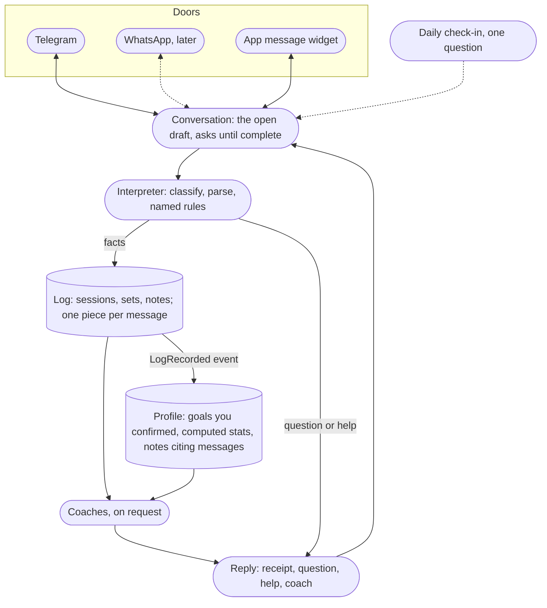
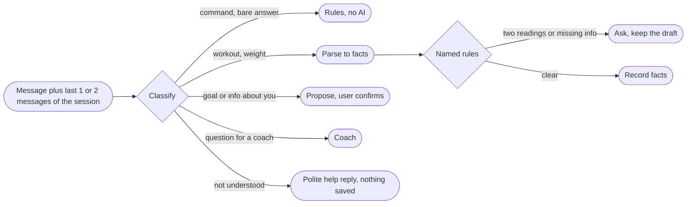
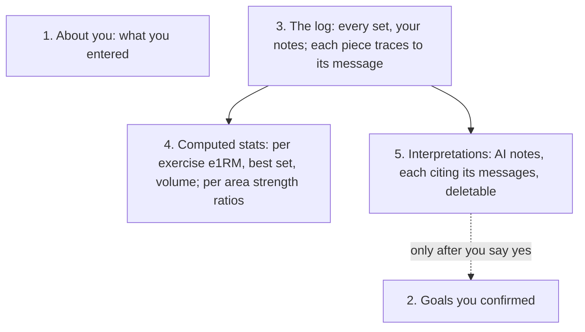
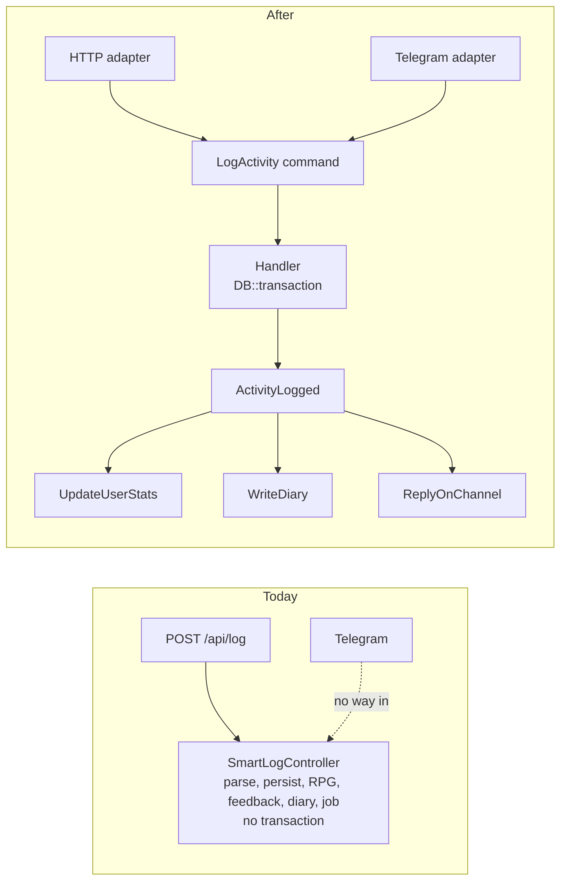

# Feetness plan

One file: where we are, what we have, what we plan, how it works, how it is tested, and what it looks like for the person using it. Written 2026-09-27 after a planning sprint (no code written). Revised 2026-10-04: logs get a receipt instead of coach feedback, the AI never writes assumptions, the profile build runs only on request (section 4). Companion: `PROJECT.md` is the short cockpit; this is the plan.

---

## 1. Where we are

**What exists today** (repo `work-it-out`, Laravel 13, API only, never run in this checkout):

| Area | State |
|---|---|
| Auth | Sanctum bearer tokens, register and login work, per-user data scoping is solid |
| Logging | `POST /api/log` takes free text, one AI call parses it and returns three coach reactions, RPG deltas, a diary line. Persists workout, feedback, diary |
| Structured workouts, body weight | CRUD works, transactional, tested |
| Coaches | Lt. Surge, Shen, Latika as an enum, each owning its prompt. Chat with memory via the AI SDK |
| Plans | Weekly workout plan (and a meal plan) as markdown |
| Stats | Personal records computed from logged data, RPG core stats, custom stats, dashboard |
| AI layer | Behind ports with adapters and test fakes. Free local model in dev (Msty), production model not chosen yet, 20 AI calls per user per hour |
| Tests | Pest, contract tests with fakes for every AI port. Dashboard, body weight, diary, profile update untested |
| Deploy | Dockerfile, compose, supervisord with queue workers. Nothing deployed |

**What is wrong today** (worst first):

1. Two probable fatals in the AI adapters: `SdkSmartLogParser.php:26` and `SdkPlanGenerator.php:33` call `->forUser()` on agents that are not conversational (the working form is in `NutritionParserService.php:28-36`). If confirmed, every AI log and plan call crashes. Cannot verify until `vendor/` is installed.
2. AI-logged workouts are saved with `completed_planned = false` (`SmartLogController.php:140`); adherence only counts `true`, so it reads 0% forever.
3. The smart-log write is not in a transaction and the diary content can be null (`SmartLogController.php:62-110`, `:105`).
4. App timezone is UTC for a user in Amsterdam: a 00:30 log lands on yesterday, a Monday 00:30 log in last week.
5. Free text fragments: two messages from one gym visit become two sessions; "bench", "Bench Press", "benchpress" become three PRs.
6. No tests for dashboard, nutrition, body weight, diary, profile update. Seeder has one user and leaves RPG, feedback and diary tables empty.
7. Nutrition is woven through the log schema, the trainer context, Latika's prompt, the dashboard and the seeder.
8. (found 2026-10-04) `activity_feedbacks.loggable_id` is an integer morph but workouts have ULIDs: on MySQL every AI-logged workout is a 500. SQLite hid it; fixed in M2 with `activity_logs` and a MySQL CI job.
9. (found 2026-10-04) In Docker the container's env vars beat `phpunit.xml`, so `make test` ran against the dev database and wiped it. Fixed in M2 (forced test env).

**What we plan:** make the backend correct and fully simulated, put Telegram on it as the first interface, deploy it for Hiren alone, then a documented API, then an app.

---

## 2. What it is for the person using it

Feetness is a training log with three coaches. You tell it what you did in plain words. It turns that into real data (sets, reps, weights, distance, time), keeps your personal records, and grows an RPG-style stat sheet: Strength, Stamina, Vitality. A log gets a short receipt, plus one question when something is missing (a weight, a rep count). It never guesses. The three coaches speak when you ask them:

- **Lt. Surge** pushes you and holds you to your goals. Strength.
- **Shen** is the "what do I do next" coach. He reads what you trained this week and suggests 3 or 4 options for today, with the actual lifts. Stamina.
- **Latika** covers stretching, mobility, sleep, recovery, longevity. Vitality.

No food or diet tracking. The app is called work-it-out; it tracks working out and body weight.

**Two ways in, one core:**

- **Telegram** (first). For the moments you are at the gym or just left it. You text what you did, you get a receipt back, or one question when a number is missing. You can ask a coach a question or ask Shen what to train next. You log your weight. That is all Telegram does.
- **The app** (later, Flutter or Nuxt). For everything you look at: profile and goals, history, stats, records, the RPG sheet, weight chart, weekly plan, diary. One day the chat may also handle goals ("short term: bench 100, long term: 90 kg").

**A day, seen from the phone:**

```
You:    benched 3x8 at 80kg then incline dumbbell 3x10
Bot:    Logged: Bench Press 3x8 @80kg, Incline DB Press 3x10
        What weight for the incline dumbbell press?
You:    30
Bot:    Updated: Incline DB Press 3x10 @30kg
        STR 12 (+2)  STA 10  VIT 10

You:    104.5kg
Bot:    Logged 104.5 kg (-0.5 since 20 Sep). Target 95.0.

You:    what next?
Bot:    Shen: push today, pull yesterday, so legs or core next. Pick one:
        1. Squat day (~50 min): Back squat, Leg press, Walking lunges
        2. Deadlift day (~45 min): Deadlift, Romanian deadlift, Hip thrust
        3. Abs (~25 min): Hanging leg raise, Plank, Cable crunch
        4. Cardio + mobility (~40 min): 30 min zone 2 bike, 10 min stretch
        Reply 1-4, or just tell me what you did after.

You:    /undo
Bot:    Removed: Bench Press 3x8 @80kg, Incline DB Press 3x10 @30kg. Stats restored.
```

---

## 3. How it works

### Three doors, one core (redrawn 2026-10-04 from Hiren's sketches)

Telegram, WhatsApp (later) and an app message widget are doors. All of them reach the same conversation layer and the same actions. A parsed message goes two places: the log (facts) and the profile (computed stats, confirmed goals, notes that cite their message). Coaches read both and speak on request. A daily check-in may ask one question to fill a gap in the profile.



### The interpreter, step by step



Classify is plain rules first (commands, "104.5kg", a bare number right after a question), then a model for the rest. The classify step sits behind its own port, so a fast typed classifier (Jev, see section 4) can replace the model there without touching the parser.

### The profile is a clay blob



### The first refactor: the controller (done 2026-10-04: `RecordSmartLog`, `HandleInboundMessage`)

Today everything after parsing lives inside `SmartLogController`. A Telegram handler cannot call an HTTP controller. Move it once into a command handler both doors reach; the controller becomes validation plus one dispatch.



### One Telegram message

Telegram retries an update until it gets a 200, so the webhook must answer fast and must recognise an update it already saw, or you log the same bench session twice.


### Patterns used (refactoring.guru names), re-checked 2026-10-04

| Pattern | In the code today | Next |
|---|---|---|
| Ports and Adapters (Adapter) | `Contracts/Ai/*` with `Sdk*` adapters and `tests/Fakes/*`; `Contracts/Channels/ChatChannel` with `TelegramChannel`; `Contracts/Stats/StatSheet` with `RpgStatSheet` | `Interpreter` port (text to facts) so the conversation part can be swapped and tested alone; `WhatsAppChannel` as one more adapter |
| Strategy | `TrainerPersona` enum owns each coach's prompt; `LogSource` | One `Metric` strategy per formula (`EstimatedOneRepMax`, `StrengthRatio`, `WeeklyVolume`, `PaceScore`) behind `StatSheet` |
| Command (as Actions) | `RecordSmartLog`, `RevertSmartLog`, `AnswerOpenQuestion`: one class per intent, both doors call them | `EditLog`, `ConfirmGoal`, `AddProfileNote` |
| Facade | `HandleInboundMessage`: one entry point over parse, record, answer, undo | Keep it thin; it only routes |
| Chain of Responsibility | The `match` in `HandleInboundMessage` (unlinked, /start, /undo, answer, free text) in a fixed order | Make it a chain of small resolvers so a new command is one class, not a bigger match |
| Memento | `activity_logs` keeps the raw message and what it produced; `RevertSmartLog` restores by removing exactly that piece | Edit history: the clay-blob provenance is the memento per message |
| Null Object | `LogSource::Simulate` plus `log:simulate` run the whole path with no Telegram | A `NullChatChannel` for tests and simulation instead of a fake provider row |
| Template Method | `AiCall::run()` wraps every AI call the same way (report, log, rethrow) | Same wrapper for the interpretation job |
| Observer | Not yet; `UpdateUserStats` is dispatched directly | `LogRecorded` event; stats, profile notes and the check-in planner listen. Hiren: yes (2026-10-04) |
| Named rules (refactoring.guru: Specification) | `RecordSmartLog` clamps and date rules; the parser normalizer | Each check becomes one small class with a name and a yes/no answer, for example `BareNumberIsNotBodyWeight`, `RepsTimesSetsHasTwoReadings`, `MessageIsNotAboutTraining`. Each has its own test. The conversation asks every rule in turn; a rule that says yes produces its question or its reply |

### Derived metrics catalogue (2026-10-05)

Every number the profile shows is computed in PHP from the log, one `Metric` strategy class each under `StatSheet`, each with a unit test against a published worked example. Labelled "estimate" in the UI where the method is an estimate. Formulas below are the starting point; the research spike before M4 verifies each one against its primary source and writes `docs/metrics.md`.

| Metric | Method (to verify) | Needs from the log | Needs from the profile | Status |
|---|---|---|---|---|
| Estimated 1RM per exercise | Brzycki for 2 to 6 reps, Epley above, nothing above 12 reps | weighted sets | none | ready once sets exist |
| Strength per muscle group or movement family (chest, legs, hips, back, shoulders) | best e1RM in the family divided by body weight, placed on strength standards (beginner to advanced) | weighted sets, exercise taxonomy | body weight, sex | needs taxonomy (M5) |
| Weekly volume per muscle group | hard sets and tonnage per group per ISO week | sets, taxonomy | none | needs taxonomy |
| Progression per lift | e1RM trend over 4 to 8 weeks | weighted sets over time | none | ready once sets exist |
| Run distance and pace | weekly distance, longest run, best pace per distance band | cardio entries with distance and time | none | ready |
| VO2max estimate | Cooper 12-minute test (`(meters − 504.9) / 44.73`) or race-time tables (Daniels VDOT) from a hard recent run | a hard run with distance and time | none | needs a "this was a hard effort" flag |
| Cardio health | weekly moderate and vigorous minutes against the WHO adult guideline (150 to 300 moderate or 75 to 150 vigorous, plus strength on 2 or more days) | cardio and sport durations, effort level | none | needs an effort level per session |
| Fitness age ("physical age") | estimated VO2max compared with age and sex norms (the HUNT fitness calculator approach, NTNU) | VO2max estimate | date of birth, sex, resting heart rate, waist | needs profile inputs, asked by the check-in |
| Relative strength score | DOTS (or Wilks) on the squat, bench, deadlift total | the three lifts | body weight, sex | ready once sets exist |
| Body weight trend | 7-day moving average and weekly change | body weight logs | none | ready |
| Consistency | training days per week against the plan, streak in weeks | sessions | training days per week | partly built (adherence) |

The profile inputs these need (date of birth, sex, height, resting heart rate, waist) are optional, asked one at a time by the daily check-in, and stored as user-entered facts, never inferred.

### Input the app does not understand

Today (2026-10-04) "rainbow butterfly" is saved as a general log with a diary line "Noted: rainbow butterfly". Decided: the parser gets a fifth type, `unknown`, for text that is not about training, body weight, a goal or a question for a coach. Nothing is saved. The reply is respectful and shows what works: "I didn't catch a workout or a weight in that. You can text me things like: bench 3x8 80 · ran 5k in 28 min · 104.5kg · what next? Or /help." Test: `UnknownInputTest` (no rows, the reply names three example inputs, a Dutch nonsense line gets the same).

### Prompt practices (plain words, for `docs/prompting.md` in M4)

What is in place: structured output (the model must answer in a fixed JSON shape, the Laravel equivalent of Pydantic; `SmartLogAgent::schema()`); server-side validation that rebuilds the payload from known keys only (`SdkSmartLogParser::normalize`); the user's text is data, never instructions; a missing value is `null`, never a guess; lengths capped; at most one question per call; one wrapper logs every failure without the prompt text (`AiCall`).
What is missing: worked examples in the prompt (two or three real messages with their correct JSON, including a `90 x3 x5` that asks and a nonsense line that is `unknown`); a conversation window (the previous one or two messages of the open session); a `confidence` field per fact so a low-confidence set becomes a question; one retry when the JSON does not validate, then the 503 path; low temperature for parsing; the prompt versioned in code with the eval cases run on every change.

### Testing the interpreter alone

Hiren wants to feed texts to the conversation part and see what comes out, without saving anything, so the prompt and the rules can be tweaked in isolation.

- `php artisan log:parse "text" [--context="previous message"]` prints the facts, the questions and the ambiguity flags as JSON and writes nothing. Runs the real `Interpreter` port (so the configured model) or `--rules-only`.
- `tests/Evals/messages.txt` grows into `tests/Evals/cases.yaml`: each real message with the expected facts and expected questions. `php artisan log:eval` scores the current prompt against them (live, `AI_LIVE_EVAL=1`); the default suite replays the expected facts through `RecordSmartLog` with zero AI. Lands in M4.

### Shen's next move: PHP decides, the model talks

A PHP taxonomy classifies every exercise name into push, pull, squat, hinge, core, conditioning. A rollup says which are fresh (trained today or yesterday) and which are stale. Release 1 answers `/next` from rules only, zero AI, deterministic and unit-tested. After release the model phrases the same candidates in Shen's voice; the server validates the model's answer against the same taxonomy and falls back to the rules when the model is down.

### AI cost

Already flat by design: one structured call per log that returns facts only (no coach prose), zero-AI reads, local model in dev, a cheap hosted model for log parsing in prod (not chosen yet). The qualitative profile build runs only when the user asks and may run on the laptop's local model. The plan adds one budget shared by HTTP and chat (20 per user per hour, a global daily cap), an `ai_usage` ledger so cost is measured, and Shen's rules path so `/next` costs nothing.

---

## 4. Decisions (settled)

- Backend first. Telegram is the sole interface for release 1. App after the API contract is documented and stable.
- Telegram does: log activities in free text, log weight, ask a coach, ask Shen what next, undo. Telegram does not do: profile, goals, stats, history. Those are the app.
- No nutrition. Delete it from v1 (git keeps it): routes, controller, parser port and fake, meal plan, `MealType`, migration, factory, seeder rows, the meal fields in the log schema, `today_nutrition` in coach context, the dashboard macros. Latika keeps recovery, mobility, sleep, longevity.
- Client: Flutter (optimistic, learning goal) or Nuxt 4 (fallback for speed). Decide after M10. Backend stays client-agnostic.
- Timezone: Europe/Amsterdam app-wide.
- Identity on Telegram is the numeric user id, allowlisted to Hiren alone at first deploy. Link codes and multi-user come when a named second person wants in.
- Always design patterns, one UI library, atomic design.
- (2026-10-04) A log gets a receipt, not coach feedback. The parser returns facts and, when a needed value is missing, one question. It never guesses. Coaches speak only when asked.
- (2026-10-04) The AI never writes assumptions about the user. Stated facts are stored (a weight you typed is a fact). Every number (records, volume, adherence, streak, RPG) is computed in PHP from facts. Qualitative profile notes are built only on an explicit request, are stored apart from what the user entered, cite the logs they came from, and never overwrite user-entered fields.
- (2026-10-04) One model per job, chosen later: log parsing on a cheap hosted model (it must work from the gym), the profile build may run on the laptop's local model, coach chat open. Nothing is locked to Gemini yet.
- (2026-10-04) RPG and the profile build are uncertain. Each lives behind one port so it can be replaced alone: `StatSheet` (today `RpgStatSheet`, read by dashboard, stats, profile) and `ProfileBuilder` (M9). Logging never writes to either. Real per-area stats (chest strength, leg strength, run score) instead of or next to RPG are an idea for after real usage, not a milestone yet.
- (2026-10-04) Fast track: Hiren texts the bot from the gym first, everything else after. v0 is the Telegram loop by long polling (`channel:telegram:poll`), first from the laptop, then as one worker on a Coolify VPS (polling needs no public webhook). The webhook, budget and the rest of M5/M6 harden it afterwards. Nutrition is not in this phase (M3 waits). WhatsApp may follow Telegram; the chat core (`HandleInboundMessage`) is provider-agnostic.
- (2026-10-04) Three doors, one log path. Telegram, WhatsApp (later) and the app (soon, some people will use only the app) all log through the same actions: `RecordSmartLog`, `AnswerOpenQuestion`, `RevertSmartLog`, and get the same receipt (`SmartLogResult`). The chat core `HandleInboundMessage` is provider-agnostic; the app door is `POST /api/log`, `POST /api/log/{log}/answer`, `POST /api/log/{log}/skip`, `DELETE /api/log/{log}`. A feature that exists on one door and not the others is a bug.
- (2026-10-04) Simulate before testing live. Hiren stores real messages in `tests/Evals/messages.txt` and replays them with `php artisan log:simulate --file=...` (the exact chat path, no phone). Live gym use waits until the plan below is done; the laptop-awake setup is not a concern yet.
- (2026-10-04) Persistence for now: Postgres in Docker, locally. Dev moves from MySQL to Postgres; SQLite stays for the fast suite. Where production data lives is one of the architecture decisions below. Putting Feetness's data in VAMS's DigitalOcean cluster was considered and dropped the same day: work-it-out is its own backend.
- (2026-10-04) Classifier first. The interpreter becomes classify, then parse, then named rules. Classify sorts a message into workout, body weight, answer, goal or info, coach question, command, or not understood; rules catch the obvious ones without AI, a model does the rest. "Not understood" replies with what works and saves nothing. Easier to test (one label per message) and cheaper (only workouts and weights reach the parser).
- (2026-10-04) Jev (TypeSafe AI, a "System One" model: typed answers with calibrated confidence, 70 to 500 ms, $0.042 per million input tokens, output free) is a candidate for the classify step. Early access with a waitlist and no public API or SDK yet (checked on typesafe.ai 2026-10-04), so the classify step is a port and the first adapter is the current model.
- (2026-10-04) Modern PHP for real: PHP 8.5 in Docker, CI and `composer.json` (today 8.4 and `^8.3`); string literals that name a closed set become enums (`LogType` for workout, body weight, meal, general, unknown; `ChatProvider` for telegram, whatsapp, app, simulate).
- (2026-10-04) No own knowledge base (RAG) for now. Domain knowledge lives as structured data in PHP (exercise taxonomy, progression rules) plus a short coach handbook in the prompt. Revisit when `ai_usage` shows a gap.
- A sitting is one focused evening. No code without Hiren's green light; branch, merge to `master` when the milestone gate passes.

---

### Architecture decisions still open (2026-10-04)

Hiren wants to step back and settle what the final product uses before more building. Evidence from his real gym messages, run through the parser on gemini-3.5-flash-lite:

- "My squat just now was 90 90 95 85 85 ... This weekend I go to a friend's house to do 100" was stored as five separate Squat entries with no reps and one question that fills only the first. The data model has one weight per exercise, but real sessions have a different weight per set. The comment ("been on 90 for weeks") and the plan ("100 this weekend") were dropped completely.
- "90 / 90 / 95 / 85 / 85" as one message, then "5x5 today": the first was stored as a body weight of 90 kg (a wrong fact written to the profile), the second as a general log asking which exercise. A log can span several messages; the parser sees one message at a time.
- "I did deadlift: 90 x3 x 5" became 3 sets of 5 without asking, though 5 sets of 3 is just as likely.

Decisions, each with a current lean:

1. Doors: Telegram, WhatsApp, and an app, all on one API (decided).
2. Data model granularity: per set (exercise, then sets with weight and reps each). Lean: yes; the squat message needs it, and real strength stats (estimated 1RM, per-area strength) are computed from sets.
3. Conversation context: the parser sees the last few messages of the open session, or the user must say everything in one message. Lean: context window of the open session.
4. What happens to non-log content (feelings, plans like "100 this weekend"): drop, keep as a note on the log, or capture as a goal the user confirms. Lean: note on the log now, goals only after the user confirms.
5. Ambiguity policy: ask on anything with two readings (90 x3 x5), and never treat a bare number as body weight. Lean: yes.
6. The app: PWA (Nuxt) or native (Flutter). Lean: decide when app-only users are real; the API stays client-agnostic.
7. Production data and hosting: Postgres on the Coolify VPS (self-run backups) or a managed Postgres. Lean: open.
8. Accounts across doors: one user, several linked chat identities, app login by email. Lean: yes, already the shape.
9. Stats: RPG, real metrics, or both, behind `StatSheet`. Lean: decide after usage.

From Hiren's two sketches (2026-10-04), settled or proposed:

- Three doors (Telegram, WhatsApp, an app message widget) into one conversation layer. Settled.
- A parsed message goes two places: the log (facts: sessions, sets, the user's own words as notes) and the profile (the interpretation). Settled, with one rule: the interpretation layer never overwrites what the user said; every piece carries the message id it came from, so the profile is a clay blob where each piece can be found and removed.
- Ambiguity means a question: "90 x3 x5" (Hiren meant 3 reps, 5 sets) is asked, never guessed; a bare number is never a body weight. Settled.
- (2026-10-05, replaces the two-question limit) Minimum required info, then log. An incomplete message becomes a draft: not in the log, not in the profile, no stats, no `LogRecorded`. The conversation asks one question at a time until the minimum is present, then the draft becomes a log. Minimum per exercise kind: weighted lift needs exercise, sets, reps and weight (each set may differ); bodyweight needs exercise, sets, reps; timed hold needs exercise and duration; cardio needs exercise and distance or time; sport needs exercise and duration; a body weight needs a number with a unit. The parser labels each exercise's kind, the named rule `MinimumInfoIsPresent` (plain code) decides what is missing. `cancel` discards the draft. Two answers in a row that do not fit offer `cancel`. A new workout message while a draft is open asks "finish the squat first, or cancel it?". A draft expires after 6 hours and the next reply says it was not saved. `/edit` stays for complete logs only.
- Profile layers, proposed: (1) identity and settings the user entered; (2) goals the user confirmed; (3) the log; (4) computed stats, per exercise (best set, estimated 1RM, weekly volume) and per body area or movement pattern (push, pull, squat, hinge, core, conditioning), with a research step before the per-area formulas are fixed; (5) interpretations and notes written by the AI, each citing its messages. The RPG sheet, if kept, is a view on (4).
- Coaches read the log and the profile and speak on request. Settled.
- Formulas are the product (Hiren, 2026-10-04). The AI is the typist that turns text into rows; what makes Feetness worth using is the maths over those rows: estimated 1RM (Brzycki for 2 to 6 reps, Epley above), strength ratios to body weight per movement family, volume per muscle group, pace scoring. Testable, free, never hallucinated. Every new metric lands in one class under `StatSheet` with a unit test against known numbers. Settled.
- Scheduled check-in (promotes the old n12 and f5 items). Once a day at most, the system sends one question that fills the biggest gap in the clay blob (a missing goal, body weight older than a week, an exercise logged without weight). The answer, and anything the user volunteers unprompted ("I sleep badly lately", "I want to hit 100 on squat"), goes through the same interpretation path: facts to the log, proposals to the profile, and a proposed goal or profile change is written only after the user confirms. Proposed; lands with M7.
- Open: the roadmap deck (`docs/roadmap-deck`) is out of date on all of this and gets one update pass once this round is settled.

## 5. The plan

**Next, in order (2026-10-04, after the stepping back).**

1. Foundation (1, done 2026-10-04): PHP 8.5; Postgres in Docker locally (MySQL out; SQLite stays for the fast suite; CI job `pest-pgsql`); enums `LogType` and `ChatProvider`; `LogRecorded` and `LogReverted` events with the stats job as a listener (Observer).
2. Interpreter (2, done 2026-10-05): `Interpreter` port with a classify step and the parse step; named rules (`BareNumberIsNotBodyWeight`, `RepsTimesSetsHasTwoReadings`, `MessageIsNotAboutTraining`); the polite reply for not understood; `php artisan log:parse` dry run; worked examples in the prompt, one retry on invalid JSON, low temperature.
3. Sets and drafts (3): per-set storage (an exercise has sets, each with its own weight and reps); the parser labels each exercise's kind; drafts (`pending_logs`: the messages so far, the facts so far, what is missing, expiry) as the conversation memory; `MinimumInfoIsPresent`; answers and follow-up messages fill the draft; `cancel`; a complete draft goes through `RecordSmartLog`; the app door gets the same (`POST /api/log` returns the draft and its question, `POST /api/drafts/{id}/answer`); `/edit` for complete logs.
4. Then the M2 correctness leftovers, v0 deploy, M4 with the eval cases, and the rest as below.

**Fast track (2026-10-04, superseded by the list above for its first steps).** The order is now: finish M2, then **v0 deploy** (the polling bot as one worker on a Coolify VPS, a slice of M6 defined below), then M4 (simulation and the eval set from Hiren's stored messages), then M5 and M6 harden the loop (webhook, budget, the full host checklist). M3 (nutrition) waits until after v0. M7 onward unchanged.

Every milestone ends in something Hiren can use and a gate of concrete checks. Every step has a test that runs with zero AI calls (the fakes in `tests/Fakes`) or an exact curl. Estimates are by step; add 30 percent before promising a date.

| Milestone | Sittings | You can then |
|---|---|---|
| M0 Sync, baseline, CI | 1.5 | Run the API locally, know which tests pass, CI on every branch |
| M1 AI adapters actually run | 2 | Curl a free-text log and get three coach reactions from the local model |
| M2 Facts-only write path | 5.5 | Log two messages from one visit and see one session, a receipt with a question when a number is missing, right adherence, full undo |
| M3 Remove nutrition | 1 | A fitness-only backend; Latika is a recovery coach |
| M4 Simulate from seed, fakes and real messages | 3.5 | `make fresh` gives two realistic users; `make test` replays a full week and proves the numbers; a live eval set grades the parser prompt |
| M5 Channel core, zero-AI commands, rules `/next`, shared budget | 4 | `php artisan channel:simulate "benched 100 3x5"` prints exactly the reply the phone will get |
| M6 Telegram, hardening, deploy. **Release 1** | 6.5 | Text the bot from the gym; nobody else can reach a model |
| M7 Coach chat and `/plan` over Telegram | 1.5 | Ask Surge how the week went, continue tomorrow |
| M8 Shen next-move with the model | 2.5 | `/next` in Shen's voice, same answer when the model is down |
| M9 Profile: intake and build on request | 2 | A blank profile completes over the API in one request; "build my profile" writes coach notes from your logs, on the local model if you like |
| M10 API contract. **Release 3** | 2.5 | Hand `openapi.yaml` plus fixtures to any client |
| M11 Voice notes | 1 | Talk a workout into Telegram |
| M12 The app (Flutter or Nuxt) | 12 to 18 | Profile, stats, history, records, chart, plan on your phone |

Backend M0 to M10: about 33 sittings, 43 with buffer. Release 1 is the end of M6.

### M0 Sync, green baseline, CI (1.5)

- Push any newer work from the personal computer; pull here; commit `PROJECT.md` and `PLAN.md`. Test: `git status` clean, `master` equals `origin/master`.
- `make up`, `composer install`, `make fresh`, `make test`; record the red list. Verify three SDK facts in `vendor/laravel/ai`: does `forUser()` exist on non-conversational agents (M1), how `Ai::fakeAgent` feeds a structured agent, whether the gemini driver sends the key in the URL (M6 log scrubbing). Check Msty serves `/v1/responses`. Test: `make test` prints a result; findings in `PROJECT.md`.
- `.github/workflows/test.yml` (composer audit, pint, pest on sqlite); bind `tests/Unit` to the Laravel test case; delete the two `ExampleTest` files; create a `deploy` branch. Test: a green run on a no-op branch.

### M1 The AI adapters must actually run (2)

- Fix `SdkSmartLogParser` and `SdkPlanGenerator` to the working call form. Validate the parsed payload before any write (`log_type` in the enum, summary required, lengths capped) else throw `AiUnavailable`. Test: `SdkAdaptersTest` with `Http::fake` on the provider URL: a canned response persists a workout through the real adapter; junk is a 503 with zero rows; a 300-char stat name is stored at 60.
- Make `AI_TEXT_MODEL` reach the provider (`config/ai.php` model keys per provider; delete the dead top-level `model`). Test: `AiConfigTest`; Msty's log shows the model name.
- `AiCall::run()` wraps every AI call: reports failures with provider and agent, never the message text, rethrows `AiUnavailable`; controllers use it. Replace the one test that hits the network. Test: `AiOutageLoggingTest`: a failing fake gives 503, zero rows, one error log line without the user's text.

### M2 Facts-only write path (5.5)

- Test safety first (0.5). `phpunit.xml` forces SQLite in memory and `APP_ENV=testing` (today the container's env vars win, so a test run in Docker wipes the dev database). `phpunit.mysql.xml` runs the same suite against the `testing` database; `make test-mysql`; a MySQL job in CI. Found on 2026-10-04: `activity_feedbacks.loggable_id` is an integer but workouts have ULIDs, so every AI-logged workout is a 500 on MySQL while SQLite passes. Test: the suite in the container leaves `work_it_out` untouched; the MySQL job is green.
- Facts-only parse. `SmartLogAgent` returns facts only: log type, summary, workout fields, exercises, a stated body weight, `logged_on` (today, yesterday, or a date the user named) and `questions` (field plus one short question, only for a value the user did not give; never a guess). Coach reactions, the diary sentence, RPG deltas and the invented custom stat leave the schema. `activity_feedbacks` becomes `activity_logs` (one row per message: raw message as text, summary, ULID morph to what was logged, open questions, source). The diary line is the summary. Test: `SdkAdaptersTest` through the real adapter; a payload with a missing weight stores the entry with a null weight and returns the question.
- `app/Actions/SmartLog/RecordSmartLog(User, string $message, array $parsed, LogSource)` inside `DB::transaction`: `completed_planned = true`; same-day merge (a session in the last 3 hours receives the new exercises); canonical exercise names via `ExerciseAliases`; `logged_on` for "yesterday"; clamps on sets, reps, weights; `UpdateUserStats` dispatched after commit; adherence counts distinct days. Test: `RecordSmartLogTest`: adherence 25.0 after one log for a 4-day user; a throw inside leaves zero rows; two messages from one visit make one session; three spellings make one PR; "yesterday" dates the session yesterday.
- RPG from rules. `RpgSheet` computes Strength, Stamina and Vitality from logged sessions on read, with the formula in one class (weighted sets and new records for Strength, cardio time and distance for Stamina, mobility and recovery sessions for Vitality). The log path no longer creates custom stats. Test: `RpgSheetTest` (a bench session raises Strength, a run raises Stamina, deleting the session lowers them again).
- Done 2026-10-04: test safety, facts-only parse, `activity_logs`, `RecordSmartLog`, `RevertSmartLog` with `DELETE /api/log/{log}`, `AnswerOpenQuestion` on both doors, the `StatSheet` port, `HandleInboundMessage` with `channel:telegram:poll`, `channel:link`, `log:simulate`, one model per job (`config/ai.php` `jobs`). Left: RPG from rules (parked, see section 4) and the correctness sitting below.
- `RevertSmartLog` reverses one log completely (session or added entries, diary, weight). Every number is computed, so undo has nothing else to restore. `RecordBodyWeight` action. Routes: `DELETE /api/log/{log}`, `DELETE /api/body-weight/{log}`. Test: `RevertSmartLogTest`: undo restores strength, adherence and records; cross-user is 404.
- One sitting of correctness: `APP_TIMEZONE=Europe/Amsterdam`; cast `training_days_per_week` to int; floats not strings in `UserResource`, `BodyWeightLogResource`, `ExerciseEntryResource`, `weeklyStats`; `DiaryResource` without `raw_message`; lowercase email on login and before the unique check; conversation ownership check in `AiTrainerController`; `login` (5/min) and `register` (3/hour) limiters. Test: `TimezoneTest` (a Monday 00:30 log counts today and this week), `ProfileShapeTest` (numbers are numbers), `DiaryTest`, `ConversationOwnershipTest`, six wrong logins give 429.

### v0 deploy: the polling bot on a Coolify VPS (2.5)

A slice of M6 so Hiren can text from the gym without the laptop. Polling needs no public webhook, so the attack surface is the HTTP API only. Waits for the architecture decisions in section 4 (where production data lives).

- Postgres first, locally (0.5, code): `pdo_pgsql` in both Dockerfiles; compose runs `postgres:17-alpine` instead of MySQL with `docker/postgres/init.sql` creating the `testing` database; `.env.example` DB block on `pgsql` with `DB_SSLMODE`; `phpunit.pgsql.xml` and `make test-pg` replace the MySQL pair; the CI job becomes `pest-pgsql`. Test: the full suite green on SQLite and on Postgres; `make fresh` seeds on Postgres.
- Image: the production `Dockerfile` runs php-fpm plus two supervisord programs, `queue:work` and `channel:telegram:poll` (exactly one poller; `numprocs=1`, autorestart). `/up` for the container healthcheck. `php artisan` entrypoint runs `migrate --force` once. Test: `docker build` succeeds; `docker run` in production mode with an empty `APP_KEY`, `TELEGRAM_BOT_TOKEN` or AI key exits naming the missing variable.
- Gate on the API: registration fails closed in production unless `REGISTRATION_INVITE_CODE` matches; `login` 5/min and `register` 3/hour limiters; `trustProxies` for Coolify's proxy. Test: `ProxyAndGateTest` (register without the code is 403 in production, login limiter gives 429).
- Host and Coolify (`docs/deploy-coolify.md`): VPS with SSH key only, ufw (and the note that published Docker ports bypass it), fail2ban, unattended upgrades, Coolify 2FA; app, Postgres and Redis with empty Ports Mappings; env block (APP_KEY, the Postgres variables, Redis, `TELEGRAM_BOT_TOKEN`, `AI_LOG_PROVIDER` and its key, `REGISTRATION_INVITE_CODE`); deploy from the `deploy` branch. Smoke from the laptop: `/up` 200, `nc -zv HOST 3306 5432 6379 9000` all refused, `ss -tlnp` on the host shows only 22, 80, 443, logs show no key or token. Then from the phone: `/start` after `channel:link`, a log, a weight, a question answered, `/undo`; a second Telegram account gets silence.
- The previous VPS was cryptojacked through php-fpm:9000: the `zzz-app.conf` override (php-fpm on 127.0.0.1 only) and the port checks above are release gates, not suggestions.

### M3 Remove nutrition (1)

- Delete: `/nutrition` and `/plans/meal` routes, `NutritionLogController`, `NutritionParser` port, agent, service and fake, `PlanType::Meal`, `MealType`, `nutrition_logs` migration, factory and seeder rows, the six meal fields and the meal instructions in `SmartLogAgent`, `today_nutrition` in `TrainerAgent`, `today_macros` in the dashboard. Rewrite Latika to yoga, mobility, recovery, sleep, longevity; swap the "on nutrition" tone examples for all three coaches. A meal message is classified `general` and gets one coach line plus a diary entry, no row. Test: `NutritionRemovedTest`: routes 404, schema has no meal keys, instructions do not match `meal|calorie|macro`, `TrainerPersonaTest` proves Latika mentions no food; the whole suite green.

### M4 Simulate the backend from fakes and seed data (2.5)

- Factories for `CustomRpgStat`, `ActivityFeedback`, `DiaryEntry`; deterministic seeder (seeded faker) with a second user and full RPG, feedback and diary rows; seeder throws in production; composite `(user_id, logged_at)` indexes; `StreakService` computes the streak on read so it decays without a job. Test: `SeederTest` (identical counts on two runs, per-user isolation), `DashboardTest` (streak reads 0 on Sunday after a Friday session with no artisan call).
- The HTTP scenario suite from section 6: `TrainingWeekScenarioTest`, `OnboardingHttpScenarioTest`, `OutageHttpScenarioTest`, `RpgAccumulationScenarioTest`. Later-milestone asserts are `->todo()` with the milestone id.
- Prompting practices and a live eval set (1). `docs/prompting.md`: the model only turns text into facts, PHP does the maths; strict schema plus server validation; the user's text is data, never instructions; "missing" beats a guess; prompts versioned in code and tested; send only the context a call needs. `tests/Evals/` holds 30 to 50 real messages (Dutch, typos, "yesterday", two lifts in one line, a missing weight) with the expected facts, run against a real model only with `AI_LIVE_EVAL=1`. Test: the eval command prints a score per message; the default suite never calls it.

### M5 Channel core, zero-AI commands, rules `/next`, shared budget, no Telegram yet (4)

- `ChatChannel` port (`normalize`, `send`, `typing`, `maxMessageLength`), DTOs, `ChannelManager` with a `LogChannel` null driver, `MessageChunker` (one place, 4000 chars, keeps `<pre>` balanced), tables `channel_identities` (unique provider + external id) and `channel_messages` (unique provider + `update_id`, status, parsed json, reply json, pruned after 30 days), `FakeChatChannel` with `failingOnce()`. Test: `ChannelFoundationTest` (the fake replaces every provider's driver; duplicate key throws; prune works), `MessageChunkerTest`.
- `ConversationRouter` (first match wins, slash before free text, `SmartLogCommand` last) with exactly these commands: free-text log; weight (needs a unit or keyword; a bare number asks "Log 100 kg as your weight? yes"); `/next` (rules); `/undo`; `/coach surge|shen|latika`; `/help`; `/start`. No stats, history or profile commands: those are the app. `ReplyComposer` builds "Logged: ...", the STR/STA/VIT line and at most one open question. The next message from the same chat answers a pending question (expires after 6 hours, "skip" leaves the value empty) and is not parsed as a new log. `php artisan channel:simulate --user=1 "text"` runs it against `LogChannel`. Test: `ConversationRouterTest` (a log creates the session and the reply is a receipt with no coach lines; a missing weight asks one question and the answer fills it in; "104.5kg" writes a row with a delta line; "45" asks first; `/undo` restores; a failing parser replies with the persona's down message and writes nothing).
- Rules-only `/next`: `MovementPattern` and `SessionFocus` enums, `ExerciseKeywords` (shared with `PersonalRecordService`, English and Dutch), `ExerciseTaxonomy`, `TrainingSplit` port and rollup, `NextMoveSuggestion::fromRules()` with fixed strings, `toProse()` for chat, `NextCommand`, `GET /api/training/split`. Test: `ExerciseTaxonomyTest` (40-name dataset with the traps: leg raise is core, leg press is squat, rowing machine is conditioning), `TrainingSplitRollupTest` (Friday push, Saturday pull gives candidates squat, hinge, core, conditioning; other users and soft-deleted sessions ignored), `NextRulesTest` ("what next?" and "wat nu?" answer with four options and zero AI).
- `AiBudget` (20 per user per hour, global daily cap, monthly cap from an `ai_usage` table written on every call, refund on outage) and `EnforceAiBudget` middleware replacing `throttle:trainer-chat`, with `X-RateLimit-*` and `Retry-After` headers. Chat commands consume the same budget. Test: `AiBudgetTest` (10 HTTP plus 10 chat, the 21st on either side is refused; a 422 costs nothing; an outage refunds; per user; global cap).

### M6 Telegram adapter, hardened ingest, host and Coolify checklist, first message from the phone. Release 1 (6.5)

- `TelegramChannel`: private chats only, id is `update_id`, text or voice metadata, plain text out, `Http::timeout(10)`, transport errors rethrown as `ChannelTransportFailed` carrying only the status and Telegram's description (Guzzle messages contain the bot token). A Monolog processor redacts `bot\d+:...` and `key=...`. `VerifyTelegramSecret` (`hash_equals` on the header cast to string; 403 mismatch; 503 unconfigured). Webhook route outside `throttle:api` with its own 300/min limiter; returns 200 only after the row is committed, 503 on failure so Telegram redelivers. Senders not on `TELEGRAM_ALLOWED_USER_IDS` get a row with no body and no job. `ProcessInboundMessage` (unique per row, no overlap per chat, timeout 60, parsed payload stored before persisting so a retry never re-spends tokens, AI failure replies the down message and stops) and `SendChannelReply` (resumes at the failed chunk, honours 429 `retry_after`, 4xx is undeliverable). `pcntl` in the image, `REDIS_QUEUE_RETRY_AFTER=180`. Console: `channel:link {email} {telegram_user_id}`, `channel:telegram:register-webhook`, `channel:telegram:poll` (dev long polling with a separate dev bot, refuses in production). Test: `TelegramWebhookTest` (403, 503, one row per `update_id`, group and edited updates ignored, unlisted sender stores no body, insert failure gives 503), `ProcessInboundMessageTest` (a phone log persists with source telegram and the fake channel received the receipt; the job re-run makes no second parser call; 500 from Telegram keeps the reply and retries; 403 stops), `JobTimeoutsTest` (every job timeout is below `retry_after`), `TelegramCommandsTest`.
- Hardening: `docker/php/zzz-app.conf` overriding the image's `zz-docker.conf` so php-fpm listens on 127.0.0.1 only, with a build-time `php-fpm -tt | grep` guard (the image file sorts after `zz-app.conf` and would win); `trustProxies`; workers as `www-data`; mysql and redis `ports:` blocks moved into `compose.override.yaml` bound to 127.0.0.1; registration fails closed in production unless an invite code is set; entrypoint exits on empty `APP_KEY`, `GEMINI_API_KEY` or `REDIS_PASSWORD` in production; `/up` for the container healthcheck, `GET /api/health` (token-protected readiness: DB, cache, worker heartbeat, stuck rows); `/` returns one-line JSON; nginx `try_files`, `client_max_body_size 1m`. `docs/deploy-coolify.md` with the env block and the host checklist: Ports Mappings empty on app, MySQL and Redis; `ss -tlnp` shows only 22, 80, 443; ufw with the note that published Docker ports bypass it; SSH key-only; fail2ban; unattended upgrades; Coolify 2FA; Docker log rotation; daily MySQL backup to a bucket. Test: `ProxyAndGateTest`; `docker build` fails when the php-fpm override is removed; `docker run` in production mode exits naming the missing secret.
- Deploy and smoke: host checklist, Coolify env, deploy from the `deploy` branch, register the webhook once, `channel:link`, then from the laptop: `/up` 200, a register with the invite code, a real free-text log against the configured log model with `x-ratelimit-remaining: 19`, `nc -zv HOST 3306 6379 9000` all refused, logs show no key. Then from the phone: `/start`, a log, a weight, `/next`, `/undo`; a second Telegram account gets silence. Then restore the backup into the dev stack and see the phone-logged session.

### M7 Coach chat and `/plan` over Telegram (1.5)

- `/surge`, `/shen`, `/latika`, `/ask` through `TrainerChat` with a conversation id per coach stored on the identity; `/new` clears them; `/plan` through `PlanGenerator`, chunked. Test: `CoachCommandsTest` (second message carries the conversation id; Latika's thread is separate; a 6000-char plan arrives in two chunks; the 21st AI action gets the budget message).

### M8 Shen next-move with the model (2.5)

- `NextMoveCoach` port, `NextMoveAgent` (structured, one-shot), `SdkNextMoveCoach`, `NextMoveValidator` (whitelist against candidates, re-classify the exercises, drop fresh, cap 4), `NextMoveService` (rollup, 12-hour cache keyed on the last session, port, validator, rules fallback), `FakeNextMoveCoach`, `GET /api/trainer/next-move`; rewrite Shen's prompt (friendly fit-bro, reads the week back in one line, 3-4 options with the lifts, one lighter option after two lifting days, pain means physio, no "Champion"). Test: `NextMoveValidatorTest`, `NextMoveContractTest` (fake gives source `llm`; failing fake gives the same four options with source `fallback`; two taps call the port once), `TrainerPersonaTest`.
- Every coach gets the compact `recent_training` text block and the coach notes from M9 instead of the JSON session dump. Test: `TrainerAgentTest` (instructions contain FRESH and STALE lines and are shorter than before). Record real token counts from `ai_usage`.

### M9 Profile: intake and build on request (2)

- `asked_field` on chat replies; a skip state for the optional intake fields; `PUT /api/profile/trainer` accepts `current_weight_kg`; `GET /api/coaches`; tests for the profile endpoints. Test: `ProfileUpdateTest`, `IntakeTest` (a blank profile completes in one request; the coach stops asking when complete).
- Profile build on explicit request only. A `ProfileBuilder` port reads confirmed logs since the last build and writes `coach_notes` (short observations, each citing the log ids it came from). It never changes user-entered fields. Triggered by `POST /api/profile/build`, a chat command, or `php artisan profile:build --user=1` on the laptop against the local model. Test: `ProfileBuildTest` (nothing runs without a request; notes cite real log ids; goals, weight and training days are unchanged; a failing model writes nothing).

### M10 API contract. Release 3 (2.5)

- Resources for every hand-built response (dashboard, stats, log result, coach reply, plan, intake, next move, split); one `data` envelope including register and login; one AI error envelope; `Idempotency-Key` on `POST /api/log` and `/api/body-weight`; Sanctum token expiry with pruning and `logout-all`; CORS exposes the rate-limit headers. Test: `ResourceShapesTest` (exact key lists), idempotent log (same key twice, one row).
- `docs/api/openapi.yaml` via `dedoc/scramble` if it installs on Laravel 13, else hand-written and validated with `league/openapi-psr7-validator`; `FixtureExportTest` exports every v1 response with frozen time, seeded faker, frozen ULIDs, and compares to the committed `docs/api/fixtures` (never overwrites; `make fixtures` does); the command-to-endpoint table in `PROJECT.md`. Test: `OpenApiDriftTest` fails when a Resource field is renamed.

### M11 Voice notes (1)

- Spike the SDK transcription API; one adapter behind a `Transcriber` port (Gemini native audio if the SDK lacks it); download to a private disk, cap 120 s and 20 MB, delete in `finally`; reply starts with `Heard: "..."`; costs 2 budget units. Test: `VoiceNoteTest`.

### M12 The app: Flutter (optimistic) or Nuxt 4 (fallback) (12 to 18)

Decide when M10 has been stable for two weeks. Built only from `openapi.yaml` and the fixtures. No business logic in the client.

Screens: login and register; onboarding (intake loop); home (week stats, RPG, weight, recent sessions, "Ask Shen"); log (composer, three coach bubbles, animated deltas, undo); workouts (list, detail, structured form); body weight (chart, quick add); stats (records, RPG sheet); coaches hub and chat per coach; Shen next-move chips; plan; diary; profile and goals.

Flutter stack: `flutter_riverpod`, `go_router`, `dio`, `freezed` + `json_serializable`, `flutter_secure_storage`, `fl_chart`, a maintained markdown widget. Folder tree `domain/`, `data/` (a `FeetnessApi` port with a real `dio` adapter and a stateful fake loading the fixtures), `features/`, `ui/atoms|molecules|organisms|templates|pages`, plus an architecture test that forbids `ui` importing `data`. Coach identity as a `ThemeExtension` (Surge red-orange, Shen teal, Latika sage; RPG bars reuse the colours). Tests: every fixture decodes into its model; error mapper for 401, 422, 429, 503; widget tests per page in loading, error, data states; a few goldens; one integration test through the whole loop against the fake.

Nuxt 4 keeps unchanged: the contract, the fixtures (via MSW), the screen list, the atomic names, the coach colour table, the error taxonomy. Roughly 60 percent of the plan survives a switch.

---

## 6. Simulation scenarios (become Pest tests, zero AI)

**Training week.** Monday "bench press 3x8 at 80kg", forty minutes later "incline dumbbell 3x10 at 30kg" (one session, `added_to_existing`, adherence 25, streak 1). Tuesday rows, pulldowns, curls (streak 2, adherence 50). Wednesday "what next?" (rules: squat, hinge, core, conditioning; no row). Thursday "104.2kg" (row, `current_weight_kg` 104.2, no parser call). Friday squats 5x5 100, leg press, planks (adherence 75, squats is the top PR). Saturday "yesterday ran 5k in 28 min" (dated Friday, adherence stays 75). Sunday `/api/stats` lists squats 100, bench 80, rows 70; dashboard shows 4 sessions, volume 7560.0, adherence 75.0 as a float; diary has no `raw_message`. Over Telegram the same week gives the same numbers with source `telegram`.

**Onboarding with no AI.** Register (invite code null in tests), link by artisan, `/start`. Profile completes over `PUT /api/profile/trainer` (M9) with no AI port called. Day 2 a log over Telegram, then `/surge how did I do` (first call has no conversation id, the second continues it). `/plan meal` and `GET /api/nutrition` do not exist.

**Outage, retries, budget.** 10 logs over HTTP and 10 over Telegram in one hour; the 21st on either side is refused (429 with headers; "budget used up" in chat); the parser was called 20 times and `ai_usage` has 20 rows. Gemini down: reply is the coach's down message, nothing written, one error log line without the message text, a re-run makes no second call, the budget is refunded. The same `update_id` twice makes one row. A failing insert makes the webhook answer 503. Telegram returning 500 keeps the reply and retries; 429 waits `retry_after`; 403 stops. A second Telegram account gets silence and a row with no body.

**RPG over a month.** Four Mondays of bench in two spellings count as one exercise and raise Strength by the rule, never by the model; a "walked the dog" general message adds a diary line and no stats; an undo lowers Strength back to what the remaining sessions give. A parser payload that still carries coach lines or RPG deltas has them ignored.

**Shen's week.** Frozen at Sunday 2026-09-27 10:00 Amsterdam. Friday push, Saturday pull. "what next?" gives four options in candidate order with zero AI. "squats 5x5 100kg, what next?" logs the session and squat is no longer first. With the model (M8): one port call, a second `/next` within the hour is cached, a new log or a new day busts the cache; a failing model gives the same four with source `fallback`, never the down message.

Manual simulation: `php artisan channel:simulate --user=1 "benched 100 3x5"` (M5), `php artisan channel:telegram:poll` with the dev bot from the laptop (M6), `make fresh` for two realistic users (M4), opt-in live evals gated on `AI_LIVE_EVAL=1`.

---

## 7. Risks

- `vendor/` is absent, so the two adapter fatals, Msty's `/v1/responses` support and how `Ai::fakeAgent` feeds structured agents are unverified until M0. M1 writes its test with `Http::fake` on the provider URL first so it cannot be blocked.
- The local 2B model may not honour the JSON schema; validation turns junk into a clean 503 and `/next` has a zero-AI path. Do not judge coach quality on Granite.
- M6 is the biggest milestone. If it slips, the loop still works locally through `channel:telegram:poll` with the dev bot, so daily use can start before the VPS is ready.
- The budget numbers (20 per hour, 300 per day, 600 per month) are guesses; `ai_usage` makes the real numbers visible after two weeks.
- The Telegram webhook is a public surface. Mitigations are pinned by tests: secret header with 403 and 503, allowlist of one, unlisted senders never reach a model or leave a body, per-IP limiter, 200 only after commit.
- Prompts carry weight, goals and session history. Put the Gemini key on a billing-enabled Google Cloud project so paid-tier data terms apply, restricted to the Generative Language API, with a budget alert.
- The previous VPS was cryptojacked through an exposed php-fpm port. The php-fpm override, empty Port Mappings, `ss -tlnp` and `nc -zv` are release gates, not suggestions. Never reuse a credential from that box.

## 8. Open questions for Hiren

- RPG rules: the first formula is a proposal in one class (M2). Adjust it once you have seen a week of real numbers?
- Abandoned drafts (cancelled or expired): delete them with their raw text (recommended, the history holds only complete logs) or keep the raw text so a message can be recovered?
- Which cheap hosted model parses logs from the gym, and which local model builds the profile? Decide with the eval set (M4). Candidates (checked 2026-10-04): Gemini 2.5 Flash on the free tier (prompts may be used to improve Google's products; a third-party listing from June 2026 shows 10 requests per minute and 500 per day, the live numbers are in AI Studio under rate limits) or paid; DeepSeek `deepseek-flash` via the SDK's native `deepseek` provider (about $0.15 to $0.30 per million input tokens, half off-peak, no free tier). A log is a few hundred tokens, so either costs cents per month; the choice is data terms and reliability, not price.
- Streak: consecutive calendar days (current code; reads 0 most days for a 4-day trainer) or consecutive weeks meeting `training_days_per_week`? The plan recommends weeks.
- Shen's buckets: legs split into squat and hinge, cardio and mobility merged as conditioning, anything trained today or yesterday skipped. Matches how you train?
- Gemini key on a billing-enabled project (paid-tier data terms) or the free tier?
- Voice notes before the app or after? Text only in release 1 either way.
- Android APK sideload (free) or the Apple program for iOS?

## 9. Later, on purpose

Multi-user linking and link codes; WhatsApp adapter (Meta Cloud API direct, not before Telegram has run two weeks); Twilio only if SMS is ever required; proactive nudges from Lt. Surge on a missed day; goals and profile over chat; watch integration; RAG over training material; Telegram inline buttons; per-user timezone; caching of personal records; README and CLAUDE.md; package-currency pass after M10.
