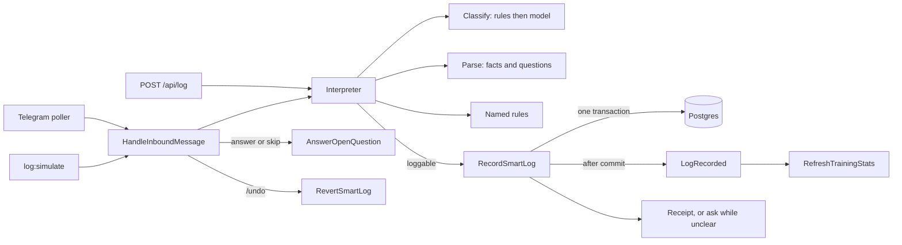

<!--
  PROJECT.md — the cockpit for this repo. One file to open and know where things stand.
  Maintained by the `project-map` skill. The assessment (status/issues/roadmap) is
  refreshed each session; the Diary at the bottom only grows. App-code changes need a
  green light; the working branch is merged to only when sure.
-->

# Feetness (work-it-out) — cockpit

**What it is** · The real backend for Hiren's fitness app: text a workout or your weight in plain language (Telegram now, an app later), an AI turns it into facts, PHP computes every number from those facts, and you get a receipt. Coaches speak only when asked. API-only; a Nuxt or Flutter frontend comes later. Goal behind it: help Hiren cut fat / build muscle at 105kg, and maybe become a product.
**This is the backend of record.** The `koala/ai-fitness-coaches-&-tracker` React+Express repo was a throwaway Google AI Studio visualization of the idea, not the plan. Build here.
**Stack** · Laravel 13 · PHP 8.5 · `laravel/ai` SDK (provider-agnostic) · Sanctum bearer auth · PostgreSQL 17 (SQLite for the fast suite) · Redis (queue/cache) · Pest 4 tests · Docker (Sail-style compose) · Pint
**Goal right now** · Text the bot from the gym and trust what it stores. The Telegram loop already runs from the laptop by long polling. Next: per-set storage and drafts (n16), then the M2 correctness leftovers, then v0 deploy so the laptop can sleep.
**Status** · 🟡 Foundation and Interpreter done, M2 mostly done, all on `master`. 122 tests, 339 assertions, green on SQLite and Postgres; CI green; audit clean. Telegram loop works from the laptop (polling). Live parse verified on gemini-3.5-flash-lite. Not yet trustworthy for real sessions: one weight per exercise (real sets differ), no drafts, UTC timezone.
**Repo** · git@github.com:Hersh3yy/work-it-out.git · one branch only: `master`. Short-lived feature branches are fine, merged and deleted the same session. No `deploy` branch: Coolify deploys `master` manually, auto-deploy off
**Hosting** · designed for Coolify/VPS (see `.env.example` production block); nothing deployed yet. Heed the VAMS VPS lessons: never expose service ports, rotate keys.
**ClickUp** · not linked yet. Needs `CLICKUP_API_KEY` in the shell and a list id here as `<!-- clickup_list:ID -->`; then `node ~/.claude/skills/project-map/scripts/clickup-sync.mjs PROJECT.md`
**Last assessed** · 2026-10-06

---

## Start here (next session, any machine)

1. `git pull` on `master` (the only branch). Read this file, then `PLAN.md`: section 4 holds every decision, section 5 "Next, in order" the build order. The diary below says what happened last.
2. Since 2026-10-04 the stack is PHP 8.5 and Postgres 17, not MySQL. On a laptop that last ran the MySQL stack:
   - `.env` is not in git. Set `DB_CONNECTION=pgsql`, `DB_HOST=postgres`, `DB_PORT=5432`, `DB_DATABASE=work_it_out`, `DB_USERNAME=sail`, `DB_PASSWORD=password` (compare with `.env.example`).
   - `docker compose build app`, then `docker compose up -d --remove-orphans` (removes the old MySQL container, keeps its volume).
   - `docker compose exec app composer install` (the lock changed for PHP 8.5). If it is killed with exit 137, install on the host and `docker cp vendor/. work-it-out-app-1:/var/www/html/vendor/`.
   - The `testing` database is created on a fresh Postgres volume by `docker/postgres/init.sql`.
3. `make test` (SQLite) and `make test-pg` (Postgres) must both be green before touching anything (122 tests on 2026-10-05).
4. Real parsing needs in `.env`: `GEMINI_API_KEY`, `AI_LOG_PROVIDER=gemini`, `AI_LOG_MODEL=gemini-3.5-flash-lite` (gemini-2.5 is retired for new keys), then `docker compose up -d --force-recreate app`. Create a user and try it: `docker compose exec app php artisan channel:link you@example.com 1 --provider=simulate`, then `php artisan log:parse "I did deadlift: 90 x3 x 5"` (saves nothing) or `php artisan log:simulate --user=<id> "bench 3x8 80"` (full path).
5. Next work item: "Next, in order" step 3 (Sets and drafts) in PLAN.md section 5. One open question for Hiren first: delete abandoned drafts with their raw text (recommended) or keep the raw text.
6. Work to the gate, `pint`, both suites, push the branch, CI green, diary entry here.

## Run it

```bash
cd work-it-out   # ~/Code/feetness/work-it-out on the work laptop
cp .env.example .env
make up                 # docker compose: app + postgres + redis + mailpit
docker compose exec app composer install
docker compose exec app php artisan key:generate
make fresh              # migrate:fresh --seed  (one demo user + ~2 weeks of data)
make test               # Pest, runs inside the container
```
API on http://localhost:8088, Mailpit on http://localhost:8025. Register a test user with `make register-test`. Local AI runs against a **free local model** (Msty MLX / Granite) via an OpenAI-compatible endpoint — you develop without spending a cent on tokens. Hosted parsing: set `AI_LOG_PROVIDER=gemini` and `AI_LOG_MODEL=gemini-3.5-flash-lite` (gemini-2.5 is retired for new keys). Each job (log, plan, chat) has its own provider and model in `config/ai.php` `jobs`. Dry run a message with `php artisan log:parse "bench 3x8 80"`; full chat path with `php artisan log:simulate --user=1 "..."`; the bot with `php artisan channel:telegram:poll`.

## Status

A free-text message goes through one path on every door: classify (plain rules first, then a model at temperature 0), parse into facts only (the model never invents a number or a judgment), named rules that catch known traps (a bare number is never a body weight; "90 x3 x5" is asked, not guessed), then `RecordSmartLog` writes it in one transaction and answers with a receipt and at most one question. A reply like "30" or "skip" fills or clears that question without AI. `/undo` reverts one log exactly. Stats are recomputed by a listener after commit. Telegram works by long polling from the laptop for linked users only.

What keeps it yellow: the data model stores one weight per exercise while real sets differ (the squat message "90 90 95 85 85" breaks it), so per-set storage and drafts (n16) come before real use; timezone is still UTC; dashboard, body weight and profile endpoints are thinly tested; nothing is deployed, so the bot only answers while the laptop runs the poller.

## Issues

| Sev | Issue | Where |
|---|---|---|
| serious | One weight per exercise entry; real sessions have a weight per set. "squat 90 90 95 85 85" becomes five entries with no reps. Fix is n16 (per-set storage + drafts) | `exercise_entries`, `RecordSmartLog::recordWorkout` |
| serious | App timezone is UTC while Hiren logs from Amsterdam: a 00:30 local log lands on yesterday, a Monday 00:30 log in last week | `config/app.php:70` |
| serious | No drafts: an incomplete message is saved as a log with a question; a log spanning several messages is not understood. n16 | `app/Channels/HandleInboundMessage.php` |
| warning | The poller advances and stores the Telegram offset before handling the message, so a crash mid-handle loses that one message (at-most-once). Fine for v0; the webhook in M6 stores first | `app/Console/Commands/TelegramPoll.php:63-66` |
| warning | Dashboard, body weight, profile update and diary endpoints have few or no tests | `tests/Feature/*` |
| warning | Seeder has one user and leaves activity logs and diary empty; no factories for `ActivityLog`, `DiaryEntry`, `CustomRpgStat` | `database/seeders/DatabaseSeeder.php` |
| warning | Dashboard runs overlapping full-history queries; `PersonalRecordService` scans all history uncached; no `(user_id, logged_at)` indexes | `DashboardController.php`, `PersonalRecordService.php` |
| warning | `/diary` returns a raw paginator, not a Resource; decimals still serialize as strings in some Resources | `DiaryController.php:22`, `UserResource.php` |
| warning | Nutrition is still in the code (routes, controller, parser, meal branch in `RecordSmartLog`). Decided: delete in M3, after v0 | `routes/api.php`, `RecordSmartLog::recordMeal` |
| minor | No login or register rate limiter beyond the global 60/min; no conversation ownership check in chat | `AppServiceProvider.php`, `AiTrainerController.php` |
| minor | README is stock Laravel; `ruby-app-scaffold-prompt.md` is a stale spec | repo root |
| fixed 2026-10-04 | `activity_feedbacks.loggable_id` was an integer while workouts use ULIDs: every AI-logged workout was a 500 on MySQL, invisible on SQLite. Replaced by `activity_logs` with a ULID morph | `2026_10_04_000001_replace_activity_feedbacks_with_activity_logs.php` |
| fixed 2026-10-04 | The test suite inside the container read the container's env and wiped the dev database. `phpunit.xml` now forces the test env as env and server vars | `phpunit.xml` |
| fixed 2026-10-04 | Adherence 0% for AI logs, non-transactional write, null diary, fragmented sessions and exercise names | `RecordSmartLog`, `ExerciseAliases`, `UpdateUserStats` |
| fixed 2026-10-03 | SDK adapter fatals (`forUser()`, `structured()`) | `app/Ai/Sdk*` |

## Guide

API-only Laravel 13 on PHP 8.5. Routes in `routes/api.php` behind `auth:sanctum`. Three doors (Telegram now, WhatsApp later, the app) share one log path; a feature on one door and not the others is a bug. Full decisions and build order: `PLAN.md` sections 4 and 5.



Where things live:
- Chat core: `app/Channels/HandleInboundMessage.php` (provider-agnostic), `app/Channels/Telegram/*`, `ReplyComposer`. Linked users only: `channel_identities` (`php artisan channel:link email id --provider=telegram|simulate`).
- Interpreter: `app/Interpretation/` (`Interpreter`, `RuleClassifier`, `Rules/*`). Saves nothing; every door decides what to do with the result.
- AI ports and adapters: `app/Contracts/Ai/*` (`MessageClassifier`, `SmartLogParser`, `TrainerChat`, `PlanGenerator`), `app/Ai/Sdk*`, agents in `app/Ai/Agents/*`, all calls wrapped by `App\Services\Ai\AiCall`. Model per job in `config/ai.php` `jobs`.
- Write path: `app/Actions/SmartLog/` (`RecordSmartLog`, `AnswerOpenQuestion`, `RevertSmartLog`, `SmartLogResult`).
- Events: `LogRecorded` and `LogReverted`, listener `RefreshTrainingStats` dispatches `UpdateUserStats` for training logs only.
- Stats behind the `StatSheet` port (`RpgStatSheet` today); personal records in `PersonalRecordService`, grouped by `ExerciseAliases::key`.
- Enums for closed sets: `LogType`, `MessageKind`, `ChatProvider`, `LogSource`, `TrainerPersona` (the coaches, Strategy).
- Tests: fakes in `tests/Fakes` bound by default in `tests/Pest.php` (including `FakeMessageClassifier`), so no test reaches a model. `tests/Evals/messages.txt` holds real messages for `log:simulate --file`.

Data: `users`, `workout_sessions` (ULID) to `exercise_entries` (each remembers the `activity_log_id` that added it), `body_weight_logs`, `activity_logs` (one row per message: raw text, summary, ULID morph to what it logged, open questions, source, `logged_on`), `diary_entries`, `channel_identities`, the SDK's `agent_conversations`.

## Hard parts

### The whole AI layer is swappable and free to test

🔭 **What it does** — Nothing outside `app/Ai` touches the SDK. Callers depend on ports (`MessageClassifier`, `SmartLogParser`, `TrainerChat`, `PlanGenerator`); real adapters wrap `laravel/ai`, and `tests/Pest.php` binds fakes by default, so the whole chat-to-database path runs with zero tokens. Provider and model are chosen per job in `config/ai.php`.

⚖️ **Why this way** — AI is slow, costs money and is non-deterministic; putting it behind a port makes all three a configuration concern instead of a testing problem.

🗣️ **Say it to a senior** — "Every model call sits behind a port with an SDK adapter and a fake, so the suite never hits a model and switching provider per job is config."

### The model types, PHP decides

🔭 **What it does** — The parser returns facts; it never guesses and never judges. Anything unclear becomes a question, and the conversation keeps asking until the log is clear (decision 2026-10-06, no cap). Then named rules in plain PHP override the model where the reading is ambiguous: `BareNumberIsNotBodyWeight` stops "90 90 95" from becoming a body weight, `RepsTimesSetsHasTwoReadings` turns "90 x3 x5" into a question that carries both counts, so the answer "5" fills sets and reps without another call.

⚖️ **Why this way** — Asking the model to be careful is a hope; a rule with a unit test is a guarantee. Every number downstream (records, adherence, RPG) is computed in PHP from the stored facts, so the model can only ever be wrong about typing, not about maths.

🗣️ **Say it to a senior** — "The LLM is the typist: it extracts facts, and deterministic named rules plus PHP formulas own every ambiguity and every number."

### Transaction first, event after commit

🔭 **What it does** — `RecordSmartLog` writes the log, session, entries, weight and diary inside one `DB::transaction`, and only after the closure returns does it dispatch `LogRecorded`. The stats job is a listener on that event, so the action knows nothing about stats.

⚖️ **Why this way** — Dispatching a queued job inside the transaction lets the worker run before the commit and read rows that do not exist yet (Laravel's redis queue has `after_commit` false by default); firing after the closure means listeners only ever see committed data.

🗣️ **Say it to a senior** — "The write is one unit of work, and side effects hang off an event fired after commit, so a stats job can never race the rows it reads."

### The ULID morph bug SQLite could not see

🔭 **What it does** — `activity_feedbacks.loggable_id` was an integer column, but `workout_sessions` use ULID keys (26 characters). SQLite stores anything in any column and the suite passed; MySQL rejected the value, so every AI-logged workout was a 500 in the real stack. `activity_logs` uses `nullableUlidMorphs`.

⚖️ **Why this way** — The lesson is the Postgres suite in CI (`make test-pg`, job `pest-pgsql`): a type bug that only a strict database catches needs a strict database in the loop.

🗣️ **Say it to a senior** — "SQLite's type affinity hid an integer morph column receiving ULIDs; we caught it by running the suite on the production engine too."

### Why the test env is forced twice

🔭 **What it does** — `phpunit.xml` sets every test variable as both `<env force="true">` and `<server force="true">`. The Docker container exports `.env` as real environment variables, which normally win over PHPUnit's, so the suite in the container pointed at the dev database and `RefreshDatabase` wiped it. Laravel reads `$_SERVER` before `$_ENV`, hence both.

⚖️ **Why this way** — Without `force`, PHPUnit only fills variables that are unset; in a container they are always set.

🗣️ **Say it to a senior** — "PHPUnit env values are defaults unless forced, and Laravel reads `$_SERVER` first, so we force both to keep tests off the dev database."

### Long polling is at-most-once

🔭 **What it does** — `channel:telegram:poll` calls `getUpdates` with an offset; Telegram forgets every update below it. The poller stores `update_id + 1` before handling each message, so a crash mid-handle drops that one message rather than replaying it.

⚖️ **Why this way** — Replaying after a crash could log the same set twice, which is worse for a training log than losing one message the user sees go unanswered. The M6 webhook stores the update first and dedupes on `update_id` for exactly-once.

🗣️ **Say it to a senior** — "The poller acknowledges before processing, so delivery is at-most-once by choice; the webhook path will store first and dedupe on update_id."

## Roadmap — near future

<!-- The full plan with acceptance tests per step is PLAN.md. Tick a milestone here when its release gate passes. Green light needed before any code change. -->

What the backend must do, in Hiren's words (2026-10-02), and where each lives:
- take logs and activities and turn them into an overall profile: exists (`POST /api/log`, RPG, PRs, dashboard); hardened in M2
- suggestions from history: Shen `/next` (rules in M5, model in M8)
- feedback: changed 2026-10-04. A log gets a receipt; while something is unclear the bot asks (no cap, 2026-10-06), no coach reactions (M2, M5). Coaches answer on request (M7). The AI never writes assumptions; the qualitative profile build runs only on request (M9)
- understand the user's high-level plan and ask questions when info is missing, capped per day: intake exists (one question per coach reply, `TrainerAgent::intakeRules`); the daily cap and short/long-term goals are new, item n12
- accept Telegram and support a frontend: M5/M6 and M10/M12

Weekend cut (minimum to log from the phone, laptop running, no deploy): M0, M1, M2.1, then M5.1 to M5.3 with only log, weight, `/next`, `/undo`, then M6.1 with `channel:telegram:poll`. Skip budget, hardening and deploy until after the weekend.

- [x] M0 Sync, green baseline, CI: suite green, SDK claims verified (fatals confirmed), GitHub Actions, deploy branch. Done 2026-10-03 <!-- id:n1 -->
- [x] M1 Day-one blockers: adapters fixed, payload validated and capped, model name per provider in `config/ai.php`, `AiCall` reports every failure. Done 2026-10-03 <!-- id:n2 -->
- [ ] M2 Facts-only write path. Done: test safety, facts-only parse with questions, `activity_logs`, `RecordSmartLog`, `RevertSmartLog`, answers on both doors, `StatSheet` port, chat core + Telegram polling, `log:simulate`, one model per job. Left: timezone Europe/Amsterdam, numbers as numbers everywhere, DiaryResource, login/register limiters, conversation ownership. RPG from rules parked <!-- id:n3 -->
- [x] Foundation: PHP 8.5, Postgres locally, `LogType` and `ChatProvider` enums, `LogRecorded` observer. Done 2026-10-04 <!-- id:n14 -->
- [x] Interpreter: classify, parse, named rules, polite help for not understood, `log:parse` dry run, prompt examples and retry. Done 2026-10-05 <!-- id:n15 -->
- [ ] Sets and drafts: per-set storage, exercise kinds, a draft keeps asking while anything is unclear (no cap) and saves only when clear, `cancel`, `/edit` for complete logs <!-- id:n16 -->
- [ ] v0 deploy: the polling bot as one supervisord worker on a Coolify VPS, registration closed in production, host checklist, smoke from the phone (PLAN.md "v0 deploy") <!-- id:n13 -->
- [ ] M3 Remove nutrition entirely (decided 2026-09-27; waits until after v0), Latika rewritten to recovery/mobility/longevity <!-- id:n4 -->
- [ ] M4 Simulate: factories + deterministic two-user seeder, streak on read, HTTP scenario suite (PLAN.md section 6), prompting practices and a live eval set of real messages <!-- id:n5 -->
- [ ] M5 Channel port + the Telegram command set (log, weight, /next, /undo, /coach) + rules-only `/next` + one AI budget shared by HTTP and chat, driven by `channel:simulate`. Profile and stats stay in the app <!-- id:n6 -->
- [ ] M6 Telegram adapter, hardened ingest, host and Coolify checklist, backups, first deploy, first message from the phone. RELEASE 1 <!-- id:n7 -->
- [ ] M7 AI commands over chat: coach threads with memory, `/plan` <!-- id:n8 -->
- [ ] M8 Shen next-move with the model on top of the rules path; compact coach context <!-- id:n9 -->
- [ ] M9 Profile: intake gaps (`asked_field`, skip state, `GET /api/coaches`) and the profile build on explicit request (coach notes citing logs, local model allowed, never overwrites user fields) <!-- id:n10 -->
- [ ] M10 API contract: Resources everywhere, one envelope, idempotency keys, OpenAPI with drift test, exported fixtures. RELEASE 3 <!-- id:n11 -->
- [ ] Coach questions with a daily cap: the coach may ask at most N intake or goal questions per day (config), tracks what was asked, and captures short-term and long-term goals (new fields) so answers over chat persist. Lands with M7 or M9 <!-- id:n12 -->

## Roadmap — far future

- [ ] M11 Voice notes over Telegram behind a Transcriber port <!-- id:f1 -->
- [ ] M12 Client v1: Flutter (optimistic) or Nuxt 4 (fallback), built only from the contract and fixtures; decide after M10 has been stable two weeks <!-- id:f2 -->
- [ ] Multi-user linking (link codes, `/link`, `/unlink`), only when a named second person wants in <!-- id:f3 -->
- [ ] WhatsApp adapter (Meta Cloud API direct), not before Telegram has run two weeks <!-- id:f4 -->
- [ ] Proactive nudges from Lt. Surge on a missed day (scheduler + `ChatChannel::send`) <!-- id:f5 -->
- [ ] Perf: cache/aggregate PersonalRecords; watch integration; RAG over training material; per-user timezone; README + CLAUDE.md; package-currency pass <!-- id:f6 -->

---


## Diary

<!-- Newest first. One entry per working session. Terse, factual, honest. Append only. -->

### 2026-10-06 — decision: ask while unclear; handoff
- Hiren: the interpreter was overthinking. Rule now: while anything is unclear, ask; no cap on questions per log; save when clear; `cancel` drops it. Recorded in PLAN.md section 4 (supersedes the one-question and two-question rules), PROJECT.md wording updated. Named rules stay as detectors that turn unclear input into a question; nothing decided on the user's behalf.
- Code still asks one question per log and saves before it is clear (`AnswerOpenQuestion` holds one open question). The change lands with n16 (drafts): a draft keeps asking until `MinimumInfoIsPresent`, only then `RecordSmartLog`.
- No code changed. `master` == `origin/master`, one branch. Next on the other laptop: n16.


### 2026-10-05 — merged to one branch, map refreshed
- Pulled the other laptop's work: 18 commits on `m2-write-path` (Foundation: PHP 8.5, Postgres 17, enums, `LogRecorded` observer; Interpreter: classify, parse, named rules, `log:parse`; M2 write path: `RecordSmartLog`, `AnswerOpenQuestion`, `RevertSmartLog`, `activity_logs`; Telegram polling loop; model per job; gemini-3.5-flash-lite; plan decisions in PLAN.md section 4).
- Verified before merging: fast-forward from `master`, `composer install` on host PHP 8.5, 122 passed (339 assertions) on SQLite, `pint` clean, `composer audit` clean, CI green on the last three commits. Read the core code (recorder, interpreter, rules, chat core, answers, poller, migration, phpunit.xml).
- Merged `m2-write-path` into `master` (fast-forward, 2546392) and deleted `m0-baseline`, `m1-adapters`, `m2-write-path` and `deploy` locally and on GitHub. One branch now. Coolify will deploy `master` manually; PLAN.md updated to match.
- PROJECT.md: What it is, Goal, Status, Issues, Guide (Mermaid of the log path), Hard parts (six blocks: ports, the model types PHP decides, transaction then event, the ULID morph bug, forced test env, at-most-once polling) rewritten for the current code.
- This laptop's local `.env` and containers are still on MySQL and PHP 8.4; follow Start here step 2 before running `make test` in Docker.
- Not done: ClickUp (no key, no list).

